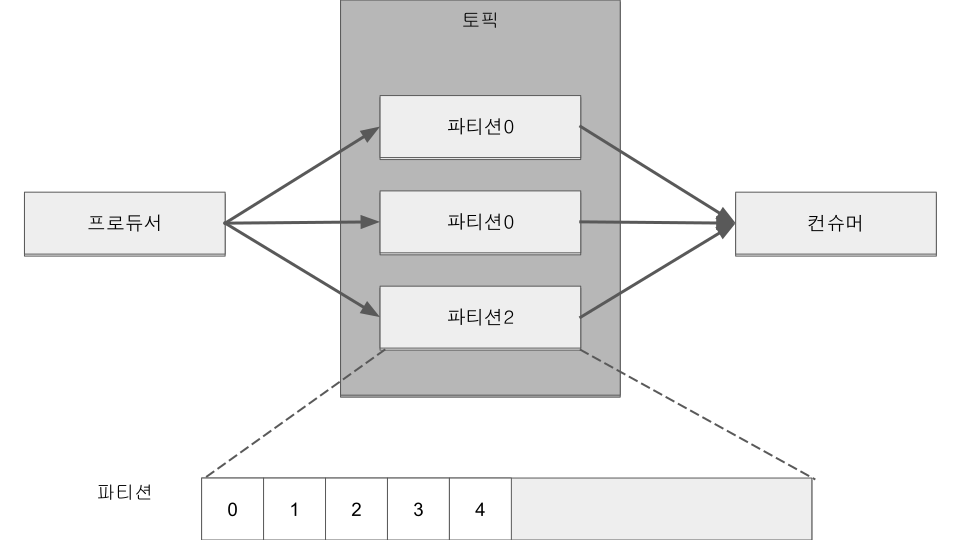
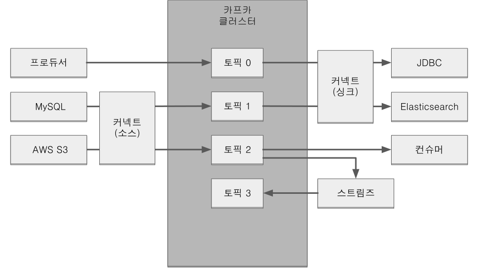
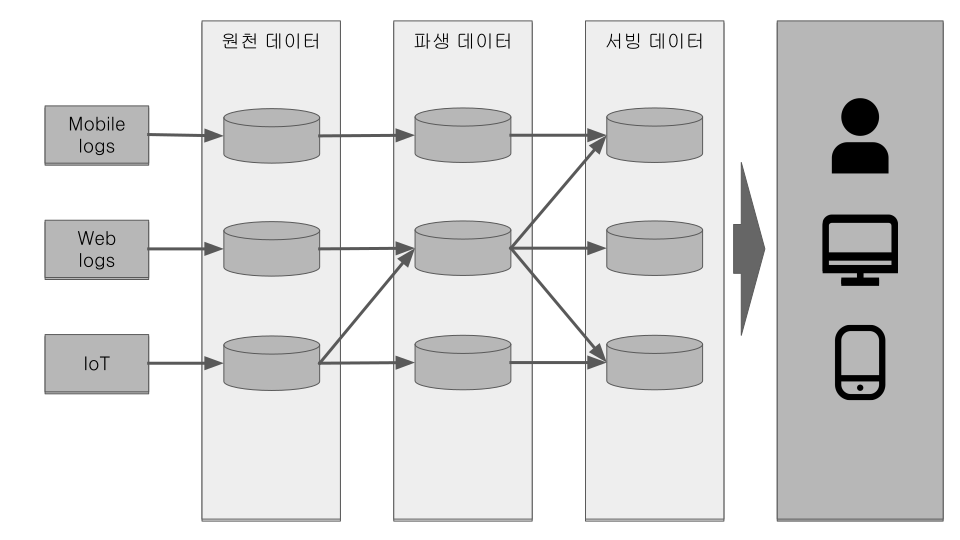
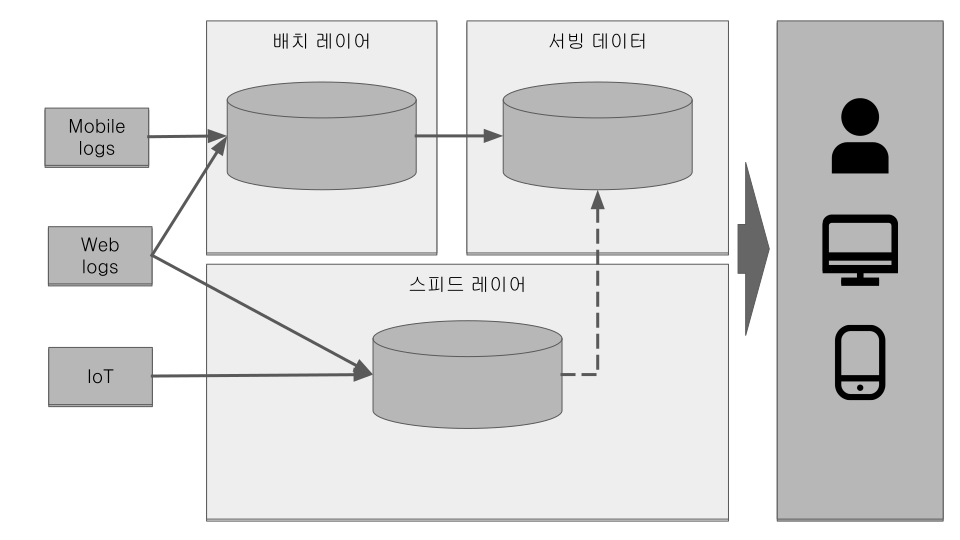
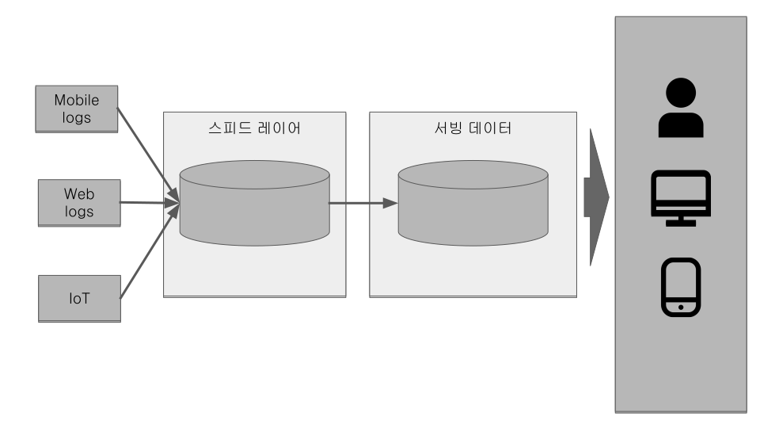
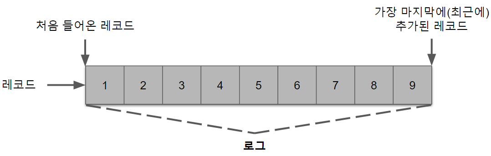
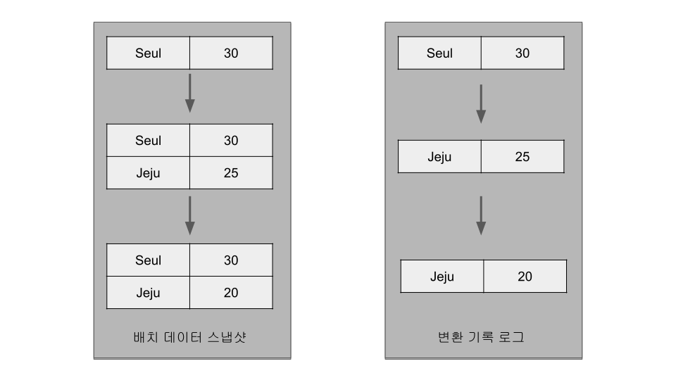
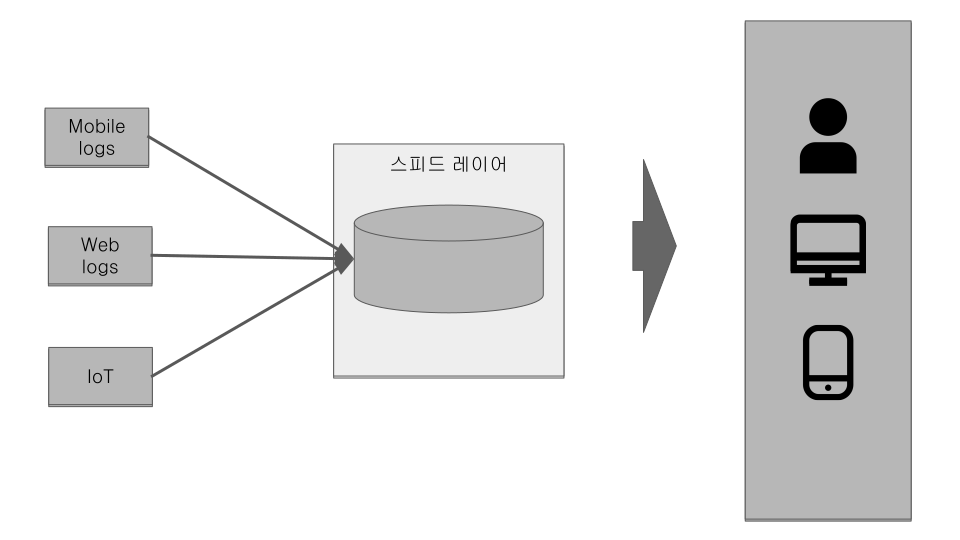
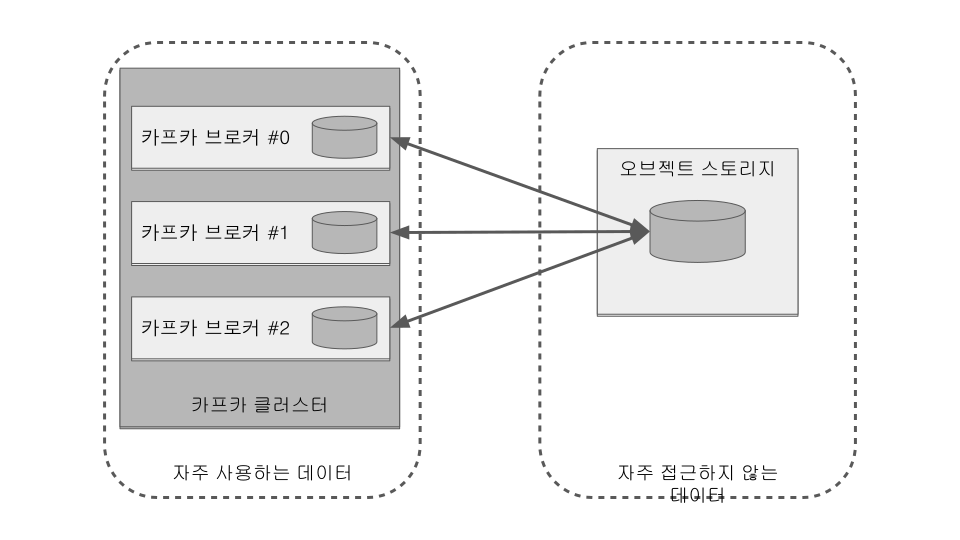

## 1 들어가며

### 1.1 카프카의 탄생

.카프카 프로듀서, 컨슈머, 토픽 모식도

### 1.2 빅데이터 파이프라인에서 카프카의 역할

*데이터 레이크(data lake)* +
데이터가 모이는 저장 공간. 데이터 웨어하우스(data warehouse)와 다르게 필터링 되거나 패키지되지 않은 데이터가 저장 +
운영되는 서비스로부터 수집 가능한 모든 데이터를 모으는 것

*데이터 파이프라인*

- 추출(extracting)
- 변경(transforming)
- 적재(loading)

*아파치 카프카가 데이터 파이프라인에 적합한 이유*

- *높은 처리량* +
데이터 묶음 처리(프로듀서가 브로커로 데이터를 보낼 때, 컨슈머가 브로커로부터 데이터를 받을 때) +
파티션 단위를 통해 동일 목적의 데이터를 여러 파티션에 분배하고 데이터를 병렬 처리 (파티션 개수만큼 컨슈머 개수를 늘려서 동일 시간당 데이터 처리량 증가)
- *확장성* +
데이터량이 가변적인 환경에서 안정적으로 확장 가능 +
데이터가 많아지거나, 적어지면 브로커 개수를 늘리거나 줄여서 스케일 아웃(scale-out), 스케일 인(scale-in) 가능
- *영속성* +
영속성이란 데이터를 생성한 프로그램이 종료되더라도 사라지지 않는 데이터의 특성을 뜻한다. +
카프카 전송받은 데이터를 파일에 저장한다. +
카프카는 운영체제 레벨에서 파일 시스템을 최대한 활용하는 방법을 적용 +
운영체제에서는 파일 I/O 성능 향상을 위해 페이지 캐시(page cache) 영역을 메모리에 따로 생성하여 사용한다.
페이지 캐시 메모리 영역을 사용하여 한번 읽은 파일 내용은 메모리에 저장시켰다가 다시 사용하는 방식이기 때문에
카프카가 파일 시스템에 저장하고데이터를 저장, 전송하더라도 처리량이 높은 것이다.
- *고가용성* +
3개 이상의 서버들로 운영되는 카프카 클러스터는 일부 서버에 장애가 발생하더라도 무중단으로 안전하고 지속적으로 데이터를 처리 가능 +
클러스터로 이루어진 카프카는 데이터의 복제(replication)을 통해 고가용성의 특징을 가진다. +
프로듀서로 전송받은 데이터를 여러 브로커에 저장

*카프카 클러스터를 3대 이상의 브로커들로 구성하는 이유* +
카프카 클러스터를 구축할 때 브로커 개수의 제한은 없다. +
1대로 운영할 경우 브로커의 장애는 서비스의 장애로 이러진다. +
2대로 운영할 경우 한 대의 브로커에 장애가 발생하더라도 나머지 한 대로 브로커가 살아 있으므로 안정적으로 데이터를 처리할 수 있다.
하지만 브로커 간에 데이터가 복제되는 시간 차이로 인해 일부 데이터가 유실될 가능성이 있다. +
유실을 막기 위해서 min.insync.replicas 옵션을 사용할 수 있다.
min.insync.replicas 옵션을 2로 설정하면 최소 2개 이상의 브로커에 데이터가 완전히 복제됨을 보장한다.
이 옵션을 2로 사용할 때는 브로커를 3대 이상으로 운영해야만 한다.
왜냐하면 3개 중 1개의 브로커에 장애가 나더라도 지속적으로 데이터를 처리할 수 있기 때문이다. +
min.insync.replicas 옵션값보다 작은 수의 브로커가 존재할 때는 토픽에 더는 데이터를 넣을 수 없다.

.카프카 생태계 모식도

### 1.3 데이터 레이크 아키텍처와 카프카의 미래

데이터 레이크 아키텍처

- 람다 아키텍처(lambda architecture) : 레거시 데이터 수집 플랫폼을 개선하기 위해 구성한 아키텍처
- 카파 아키텍처(kappa architecture)

.레거시 데이터 플랫폼 아키텍처

단점

- 데이터를 배치로 모으는 구조는 유연하지 못함
- 실시간으로 생성되는 데이터들에 대한 인사이트를 서비스 애플리케이션에 빠르게 전달하지 못함
- 원천 데이터로부터 파생된 데이터의 히소트로를 파악하기 어려움
- 계속되는 데이터의 가공으로 인해 데이터파 파편화되면서 데이터 거버넌스(data governace: 데이터 표준 및 정책)를 지키기 어려움

.람다 아키텍처

레거시 데이터 플랫폼 아키텍처 문제해결을 위해 스피드 레이어(speed layer)라고 불리는 실시간 데이터 ETL작업 영역을 정의

- 배치 레이어: 배치 데이터를 모아서 특정 시간, 타이밍마다 일괄 처리
- 서빙 레이어(serving layer): 가공된 데이터를 데이터 사용자, 서비스 애플리케이션이 사용할 수 있도록 데이터가 저장된 공간
- 스피드 레이어: 서비스에서 생성되는 원천 데이터를 실시간으로 분석. 배치 데이터에 비해 낮은 지연으로 분석이 필요한 경우에 스피드 레이어를 통해 데이터를 분석.

스피드 레이어에서 가공, 분석된 실시간 데이터는 사용자 또는 서비스에서 직접 사용할 수 있자만 필요한 경우에는 서빙 레이어로 데이터를 모내서 저장하고 사용할 수 있다. +
람다 아키텍처에서 카프카는 스피드 레이어에 위치

장점

- 데이터를 배치 처리하는 레이어와 실시간 처리하는 레이어를 분리하여 데이터 처리 방식을 명확히 나눔

단점

- 데이터를 분석, 처리하는 데에 필요한 로직이 2벌로 각각의 레이어에 따로 존재해야 한다
- 배치 데이터와 실시간 데이터를 융합하여 처리할 때는 다소 유연하지 못한 파이프라인을 생성

.카파 아키텍처

제이 크렙스(Jay Kreps: 카프카를 최초로 고안한 개발자, 전 링크드인 팀장, 현 컨플루언트 CEO)가 제안 +
람다 아키텍처의 단점을 해소하기 위해 배치 레이어를 제거하고 모든 데이터를 스피드 레이어에 넣어서 처리

- 로직의 파편화, 디버깅, 배포, 운영 분리에 대한 이슈를 제거를 위해서 람다 아키텍처에서 배치 레이어 제거
- 스피드 레이어에서 데이터를 모두 처리

스피드 레이어에서 모든 데이터를 처리하므로 서비스에서 생성되는 모든 종류의 데이터를 스트림 처리해야 한다.

[NOTE]
====
*배치 데이터와 스트림 데이터*

'배치 데이터'는 초, 분, 시간, 일 등으로 한정된(bounded) 기간 단위 데이터를 뜻한다.
배치 데이터를 일괄 처리(batch processing)하는 것이 특징

'스트림 데이터'는 한정되지 않은(unbounded) 데이터로 시작 데이터와 끝 데이터가 명확히 정해지지 않은 데이터를 뜻한다.
각 지점의 데이터는 보통 작은 단위(KB 단위)로 쪼개져 있다.
====

배치 데이터를 스트림 프로세스로 처리.
제이 크랩스가 모든 데이터를 로그(log)로 바라보는 것에서 시작.
여기서 로그는 애플리케이션 로깅이 아닌 데이터의 집합을 뜻한다.
이 데이터는 지속적으로 추가가 가능하며 각 데이터에는 일정한 번호(또는 타임스탬프)가 붙는다.

.제이 크렙스가 고안한 로그

로그는 배치 데이터를 스트림으로 적합. +
배치 데이터를 표현할 때는 각 시점(시간별, 일자별 등)의 전체 데이터를 백업한 스냅샷 데이터를 뜻했다. +
그러나 배치 데이터를 로그로 표현할 때는 각 시점의 배치 데이터의 변환 기록(change log)을 시간 순서대로 기록함으로써 각 시점의 모든 스냅샷 데이터를 저장하지 않고도 배치 데이터를 표현할 수 있게 되었다.

.기존 스냅샷으로 배치 데이터를 표현한 모습과 로그로 배치 데이터를 표현한 모습

로그로 배치 데이터와 스트림 데이터를 저장하고 사용하기 위해서는 변환 기록이 일정 기간 동안 삭제되어서는 안 되고 지속적으로 추가되어야 한다.
그리고 서비스에서 생성된 모든 데이터가 스피드 레이어에 들어오는 것을 감안하면 스피드 레이어를 구성하는 데이터 플랫폼은 SPOF(Single Point Of Failure)가 될 수 있으므로
반드시 내결함성(High Availability)과 장애 허용(fault tolerant) 특징을 지녀야 했다.
아파치 카프카는 이러한 특징에 정확히 부합하는 플랫폼이다.
카프카 내부에서 사용되는 파티션, 레코드, 오프셋은 제이 크랩스가 정의한 로그의 데이터 플랫폼 구현체로 볼 수 있다.

.스트리밍 데이터 레이크 아키텍처

2020년 카프카 서밋에서 제이 크랩스는 카파 아키텍처에서 서빙 레이어를 제거한 아키텍처인 스트리밍 데이터 레이크(streaming data lake)를 제안 +
카파 아키텍처에서 데이터를 사용하는 고객을 위해 스트림 데이터를 서빙 레이어에 저장 +
서빙 레이어는 하둡 파일 시스템(HDFS), 오브젝트 스토리지(S3, minio 등)와 같이 데이터 플랫폼에서 흔히 사용되는 저장소

스피드 레이어로 사용되는 카프카에 분석과 프로세싱을 완료한 거대한 용량의 데이터를 오랜 기간 저장하고 사용할 수 있다면 서빙 레이어는 제거되어도 된다. +
오히려 서빙 레이어와 스피드 레이어가 이중으로 관리되는 운영 리소스를 줄일 수 있다.

스피드 레이어에서 데이터를 분석, 프로세싱, 저장함으로써 단일 진실 공급원(SSOT, Single Source Of Truth)가 된다.
스트리밍 데이터 레이크의 스피드 레이어만 참조함으로써 데이터의 중복 비정합성과 같은 문제에서 벗어날 수 있다.

아직은 카프카를 스트리밍 데이터 레이크로 사용하기 위해 개선해야 하는 부분이 있다. +
우선 자주 접근하지 않는 데이터를 굳이 비싼 자원(브로커의 메모리, 디스크)에 유지할 필요가 없다. +
카프카 클러스터에서 자주 접근하지 않는 데이터는 오브젝트 스토리지와 같이 저렴하면서도 안전한 저장소에 옮겨 저장하고 자주 사용하는 데이터만 브로커에서 사용하는 구분 작업이 필요하다.
카프카 클러스터가 단계별 저장소를 가질 수 있도록 추가 기능 개발 진행사항 link:https://cwiki.apache.org/confluence/display/KAFKA/KIP-405%3A+Kafka+Tiered+Storage[KIP-405]

.단계별 저장소를 가진 카프카 클러스터 모식도

카프카의 데이터를 쿼리(query)할 수 있는 주변 데이터 플랫폼이 필요 +
컨플루언트(Confluent)에서 카프카의 데이터를 SQL 기반으로 조회할 수 있도록 카프카 스트림즈를 추상화한 ksqlDB(https://ksqldb.io/) 를 오픈소스로 제공 +
ksqlDB는 아직 타임스탬프, 오프셋, 파티션 기반 쿼리를 제공하지 않기 때문에 배치 데이터를 완벽히 처리하기에는 부족 +
이외에도 아파치 스파크 스트리밍, 프레스토, 아파치 드릴, 하이브/스파크 SQL 등을 조합하는 방식도 스트리밍 데이터 레이크로 사용하는 방법이라 볼 수 있으나 모든 데이터 형태와 포맷을 지원하는 것이 아니다.

