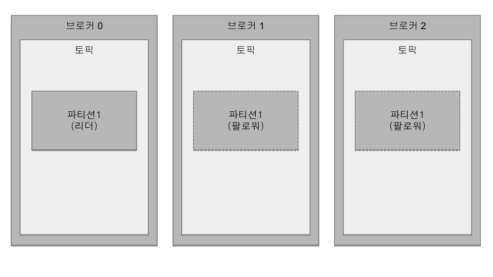
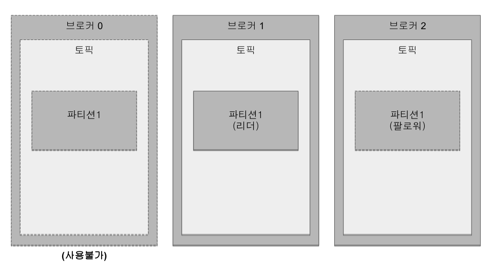
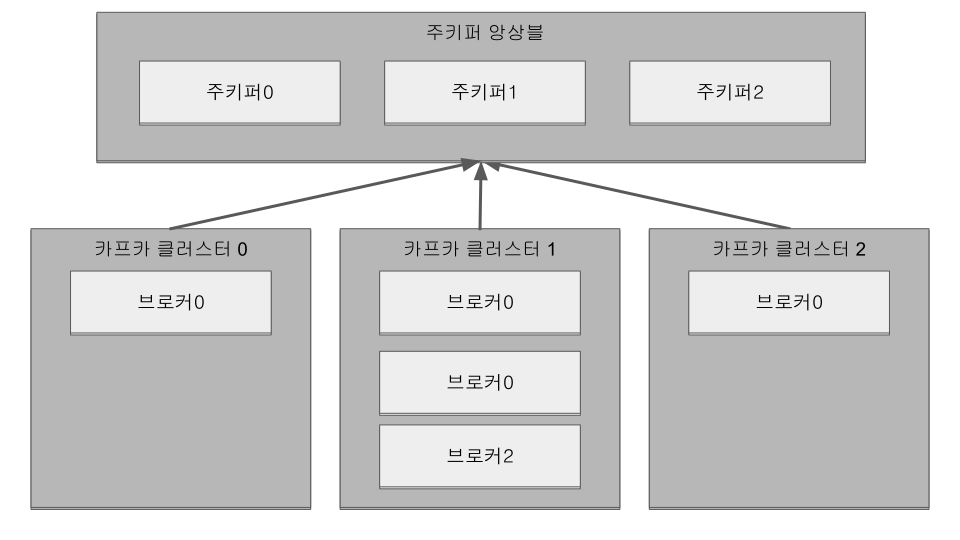
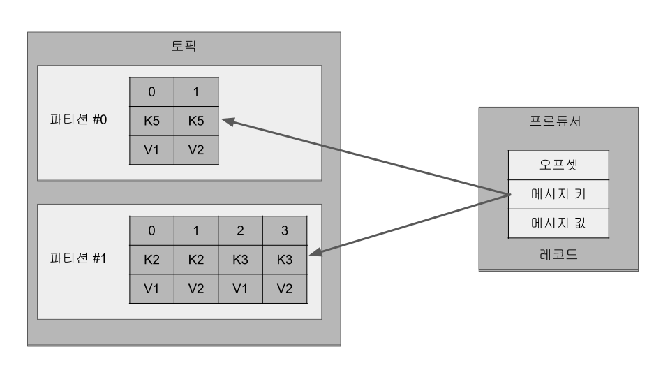
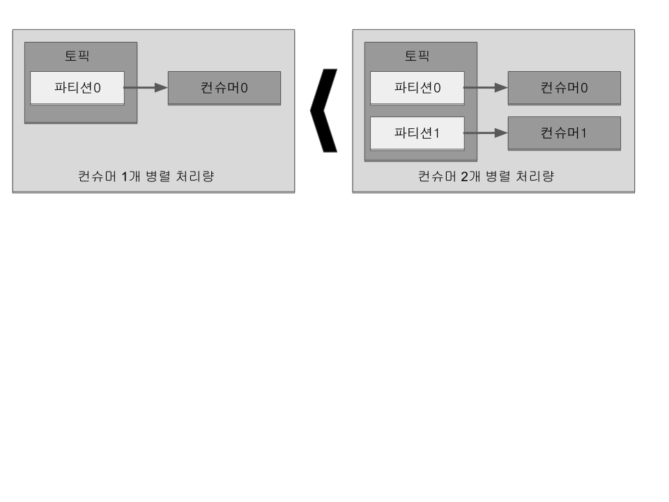

## 3. 카프카 기본 개념 설명

### 3.1 카프카 브로커·클러스터·주키퍼

브로커: 카프카 클라이언트와 데이터를 주고받기 위해 사용하는 주체이자,
데이터를 분산 저장하여 장애가 발생하더라도 안전하게 사용할 수 있도록 도와주는 애플리케이션

데이터를 안전하게 보관하고 처리하기 위해 3대 이상의 브로커 서버를 1개의 클러스터로 묶어서 운영 +
카프카 클러스터로 묶인 브로커들은 프로듀서가 보낸 데이터를 안전하게 분산 저장하고 복제하는 역할을 수행

**데이터 저장, 전송**

프로듀서로부터 데이터를 전달받으면 카프카 브로커는 프로듀서가 요청한 토픽의 파티션에 데이터를 저장하고
컨슈머가 데이터를 요청하면 파티션에 저장된 데이터를 전달

프로듀서로부터 전달된 데이터는 파일 시스템에 저장

.#1 Kafka dataDir, config.server.properties - log.dir 옵션
```
$ ls /tmp/kafka-1-logs/
__consumer_offsets-0   __consumer_offsets-27  __consumer_offsets-42      log-start-offset-checkpoint       test-2
__consumer_offsets-12  __consumer_offsets-3   __consumer_offsets-45      meta.properties                   test-3
__consumer_offsets-15  __consumer_offsets-30  __consumer_offsets-48      recovery-point-offset-checkpoint
__consumer_offsets-18  __consumer_offsets-33  __consumer_offsets-6       replication-offset-checkpoint
__consumer_offsets-21  __consumer_offsets-36  __consumer_offsets-9       test-0
__consumer_offsets-24  __consumer_offsets-39  cleaner-offset-checkpoint  test-1
```

.#2 Partition
```
$ ls /tmp/kafka-1-logs/test-0/
00000000000000000000.index  00000000000000000000.timeindex  partition.metadata
00000000000000000000.log    leader-epoch-checkpoint
```

. log.dir 에 지정한 경로에 데이터를 저장 +
토픽 이름과 파티션 번호의 조합으로 하위 디렉토리를 생성하여 데이터 저장

. test 토픽의 0번 파티션 데이터 +
- log: 메시지와 메타데이터 +
- index: 메시지의 오프셋을 인덱싱한 정보
- timeindex: 메시지에 포함된 timestamp값을 기준으로 인덱싱한 정보 +
카프카 0.10.0.0 버전 이후로 메시지에는 timestamp 값이 포함. timestamp 값은 브로커가 적재한 데이터를 삭제하거나 압축하는데 사용

카프카는 메모리나 데이터베이스에 저장하지 않으며 따로 캐시메모리를 구현하여 사용하지도 않는다. +
카프카는 페이지 캐시(page cache)를 사용하여 디스크 입출력 속도를 높인다. +

페이지 캐시란 OS에서 파일 입출력의 성능 향상을 위해 만들어 놓은 메모리 영역 +
한번 읽은 파일의 내용은 메모리의 페이지 캐시 영역에 저장. 추후 동일한 파일의 접근이 일어나면 디스크에서 읽지 않고 메모리에서 직접 읽는 방식

이러한 특징 때문에 카프카 브로커를 실행하는데 힙 메모리 사이즈를 크게 설정할 필요가 없다.

**데이터 복제, 싱크**

데이터 복제(replication)은 카프카를 장애 허용 시스템(fault tolerant system)으로 동작하도록 하는 원동력 +
복제의 이유는 클러스터로 묶인 브로커 중 일부에 장애가 발생하더라도 데이터를 유실하지 않고 안전하게 사용하기 위함.

카프카의 데이터 복제 단위는 파티션, 토픽을 생성할 때 파티션을 복제 개수(replication factor) 설정 +
옵션을 설정하지 않으면 브로커에 설정된 옵션값 사용 +
최소값은 1(복제 없음)이고 최대값은 브로커 개수

.토픽의 파티션의 복제 개수가 3인 경우


복제된 파티션은 리더(leader)와 팔로워(follower)로 구성

- 리더(leader): 프로듀서 또는 컨슈머와 직접 통신하는 파티션
- 팔로워: 복제 데이터를 가지고 있는 파티션

팔로워 파티션들은 리더 파티션의 오프셋을 확인하여 현재 자신이 가지고 있는 오프셋과 차이나 나는 경우 리더 파티션으로부터 데이터를 가져와서 자신의 파티션에 저장하는데, 이 과정이 '복제(replication)'

복제 개수만큼의 저장 용량이 증가한다는 단점이 존재. +
그러나 복제를 통해 데이터를 안전하게 사용할 수 있다는 강력한 장점 때문에 카프카를 운영할 때는 2 이상의 복제 개수를 정하는 것이 중요.

.브로커 0에 장애가 발생한 경우


브로커가 다운되면 해당 브로커에 있는 리더 파티션을 사용할 수 없기 때문에 팔로워 파티션 중 하나가 리더 파티션 지위를 넘겨받음.
이를 통해 데이터가 유실되지 않고 컨슈머나 프로듀서와 데이터를 주고받도록 동작.


- 복제개수 1 또는 2: 데이터가 일부 유실되어도 무관하고 데이터 처리 속도가 중요
- 복제개수 3: 유실이 일어나면 안 되는 데이터 (최대 2개의 브로커에서 동시에 장애 발생 대응)

**컨트롤러(controller)**

클러스터의 브로커 중 한 대가 컨트롤러 역할을 수행. +
다른 브로커의 상태를 체크하고 브로커가 클러스터에서 빠지는 경우 해당 브로커에 존재하는 리더 파티션을 재분배. +
컨트롤러 역할을 하는 브로커에 장애가 생기면 다른 브로커가 컨트롤러 역할 수행.

**데이터 삭제**

카프카는 컨슈머가 데이터를 가져가더라도 토픽의 데이터는 삭제되지 않음. +
또한, 컨슈머나 프로듀서가 데이터 삭제를 요청할 수 없음. 브로커만 데이터 삭제 가능.

데이터 삭제는 '로그 세그먼트(log segment)' 파일 단위로 이루어짐. +
세그먼트에는 다수의 데이터가 들어 있기 때문에 일반 데이터베이스처럼 특정 데이터를 선별해서 삭제 불가.

세그먼트는 데이터가 쌓이는 동안 파일 시스템으로 열려있으며
카프카 브로커의 log.segment.bytes 또는 log.segment.ms 옵션이 충족되면 세크먼트 파일이 닫힘. 기본값은 1GB. +
너무 작은 용량을 설정하면 데이터들을 저장하는 동안 세그먼트 파일을 자주 여닫음으로써 부하가 발생할 수 있으므로 주의.

닫힌 세그먼트 파일은 log.retention.bytes 또는 log.retention.ms 옵션을 넘어가면 삭제. +
닫힌 세그먼트 파일을 체크하는 간격은 log.retention.check.interval.ms를 따름.

카프카는 데이터를 삭제하지 않고 메시지 키를 기준으로 오래된 데이터를 압축하는 정책도 가능. 토픽 압축 정책은 챕터 4.

**컨슈머 오프셋 저장**

컨슈머 그룹은 토픽이 특정 파티션으로부터 데이터를 가져가서 처리하고 이 파티션의 어느 레코드까지 가져갔는지 확인하기 위해 오프셋을 커밋. +
커밋한 오프셋은 __consumer_offsets 토픽에 저장. 여기에 저장된 오프셋을 토대로 컨슈머 그룹은 다음 레코드를 가져가서 처리.

**코디네이터(coordinator)**

클러스터의 브로커 중 한 대가 코디네이터 역할을 수행. +
컨슈머 그룹의 상태를 체크하고 파티션을 컨슈머와 매칭되도록 분배. +
컨슈머가 컨슈머 그룹에서 빠지면 매칭되지 않은 파티션을 정상 동작하는 컨슈머로 할당하여 끊임없이 데이터가 처리되도록 도움. +
리밸런스(rebalance): 파티션을 컨슈머로 재할당하는 과정

**주키퍼(Zookeeper)**

카프카의 메타데이터 관리

주키퍼 쉘: bin/zookeeper-sheel.sh

```
# 1
$ ./bin/zookeeper-shell.sh 127.0.0.1:2181/test-kafka
Connecting to 127.0.0.1:2181/test-kafka
Welcome to ZooKeeper!
JLine support is disabled

WATCHER::

WatchedEvent state:SyncConnected type:None path:null
# 2
ls /
[admin, brokers, cluster, config, consumers, controller, controller_epoch, feature, isr_change_notification, latest_producer_id_block, log_dir_event_notification]
# 3
ls /brokers/ids
[1, 2, 3]
# 4
get /brokers/ids/1
{"features":{},"listener_security_protocol_map":{"PLAINTEXT":"PLAINTEXT"},"endpoints":["PLAINTEXT://127.0.0.1:9092"],"jmx_port":-1,"port":9092,"host":"127.0.0.1","version":5,"timestamp":"1647963248963"}
# 5
get /controller
{"version":1,"brokerid":1,"timestamp":"1647963249598"}
# 6
ls /brokers/topics
[__consumer_offsets, test]
```

. zookeeper-shell.sh 명령어와 127.0.0.1:1281/test-kafka 옵션을 사용하여 주키퍼에 접속. +
주키퍼 쉘을 통해 znode를 조회하고 수정 가능.
. test-kafka znode의 하위 znode들을 확인.
. 브로커 id 목록 확인
. 1번 브로커 정보 확인. 보안 규칙, jms port, host, port 등
. 컨트롤러(controller) 브로커 확인
. 토픽 목록 조회. +
__consumer_offsets 토픽은 카프카 내부에서 컨뮤서 오프셋을 저장하기 위한 용도

.3개의 카프카 클러스터가 1개의 주키퍼와 연결되어 운영


카프카 클러스터로 묶인 브로커들은 동일한 경로의 주키퍼 경로로 선언. +
만약 클러스터를 여러 개로 운영한다면 한 개의 주키퍼에 다수의 카프카 클러스터를 연결해서 사용 가능.

[TIP]
====
**주키퍼에서 다수의 카프카 클러스터를 사용하는 방법**

주키퍼의 서로 다른 znode에 카프카 클러스터들을 설정하면 된다. +
znode란 주키퍼에서 사용하는 데이터 저장 단위이다.
마치 파일 시스템처럼 znode 간에 계층 구조를 가진다.
1개의 znode에는 n개의 하위 znode가 존재하고 계속해서 tree 구조로 znode가 존재할 수 있다. +
2개 이상의 카프카 클러스터를 구축할 때는 root znode(최상위 znode)가 아닌 한 단계 아래의 znode를 카프카 브로커 옵션으로 지정하도록 한다.
각기 다른 하위 znode로 설정된 서로 다른 카프카 클러스터는 각 클러스터의 데이터에 영향을 미치지 않고 정상 동작한다.

주키퍼 옵션 정의 예제
* 파이프라인용 카프카 클러스터: zookeeper.connect=localhost:2181,localhost:2182,localhost:2183/pipeline
* 실시간 추천용 카프카 클러스터: zookeeper.connect=localhost:2181,localhost:2182,localhost:2183/recommend
====

### 3.2 토픽과 파티션

토픽(topic) : 데이터를 구분하는 단위. 토픽은 1개 이상의 파티션을 소유. +
파티션에는 프로듀서가 보낸 데이터들이 저장되는데 이 데이터가 '레코드(record)'.

.프로듀서가 전송한 레코드는 파티션에 저장된다.


파티션은 카프카의 병렬처리의 핵심 +
그룹으로 묶인 컨슈머들이 레코드를 병렬로 처리할 수 있도록 매칭

컨슈머의 처리량이 한정된 상황에서 많은 레코드를 병렬로 처리하는 가장 좋은 방법은 컨슈머의 개수를 늘려 스케일 아웃하는 것 +
컨슈머 개수를 늘림과 동시에 파티션 개수도 늘리면 처리량이 증가하는 효과를 볼 수 있음.

.파티션 개수와 컨슈머 개수를 늘려서 처리량을 늘린다


파티션은 큐(queue)와 비슷한 구조. +
First-in-first-out(FIFO) 구조와 같이 먼저 들어간 레코드는 컨슈머가 먼저 가져감. +
다만, 일반적인 큐는 데이터를 가져가면(pop) 레코드를 삭제하지만 카프카에서는 삭제하지 않음. +
파티션의 레코드는 컨슈머가 가져가는 것과 별개로 관리. +
이러한 특징 때문에 토픽의 레코드는 다양한 목적을 가진 여러 컨슈머 그룹들이 토픽의 데이터를 여러 번 가져가는 것이 가능.

**토픽 이름 제약 조검**

* 빈 문자열 불가능
* 마침표 하나(.) 또는 마침표 둘(..) 불가능
* 249자 미만
* 영어 대소문자와 숫자 0부터 9, 마침표(.), 언더바(_), 하이픈(-) 조합 : 이 외 문자열은 불가
* 내부 로직 관리 목적인 2개 토픽(__consumer_offsets, __transaction_state) 이름 불가
* 마침표(.)와 언더바(_) 동시 사용 불가
* 기존 토픽 이름의 마침표(.)나 언더바(_)를 언더바(_)나 마침표(.) 변경한 것이 신규 토픽 이름과 동일하면 생성 불가. +
예) to.pic 이름의 토픽이 존재한다면 to_pic 이름의 토픽 생성 불가

**의미 있는 토픽 이름 작명 방법**

토픽 이름은 데이터의 얼굴.

토픽 이름에는 영어 대소문자 외에  마침표(.), 언더바(_), 하이픈(-) 사용 가능 +
토픽 이름 작성 시 구분자로 이 문자들을 사용하면 편리하게 읽기 가능. +
프로듀서나 컨슈머에서 대소문자를 구분하여 처리. +
휴먼에러(human error)로 인한 실수 방지를 위해 대문자와 소문자를 섞어서 쓰는 카멜케이스(CamelCase) 보다는 +
케밥케이스(kebab-case) 또는 스네이크 표기법(snake_case)와 같이 소문자를 쓰되 구분자로 특수문자를 조합하여 사용.

[NOTE]
====
**토픽 작명의 템플릿과 예시**

* **<환경>.<팀-명>.<애플리케이션-명>.<메시지-타입>** +
예시) prd.marketing-team.sms-platform.json
* **<프로젝트-명>.<서비스-명>.<환경>.이벤트-명>** +
예시) commerce.payment.prd.notification
* **<환경>.<서비스-명>.<JIRA-번호>.<메시지-타입>** +
예시) dev.email-sender.jira-1234.email-vo-custom
* **<카프카-클러스터-명>.<환경>.<서비스-명>.<메시지-타입>** +
예시) aws-kafka.live.marketing-platform.json

====

중요한 것은 토픽 이름에 대한 규칙을 사전에 정의하고 구성원들이 그 규칙을 잘 따르는 것 +
규칙을 정해도 따르지 않으면 예측하지 못한 방향으로 토픽 이름이 생성될 것이고 이것들은 기술 부채(technical debt)로 남음. +
카프카는 토픽 이름 변경을 지원하지 않으므로 이름을 변경하기 위해서는 삭제 후 다시 생성하는 것 외에는 방법이 없음.

### 3.3 레코드

레코드는 타임스탬프, 메시지 키, 메시지 값, 오프셋으로 구성 +
프로듀서가 생성한 레코드가 브로커로 전송되면 오프셋과 타임스탬프가 지정되어 저장. +
브로커에 적재된 레코드는 수정할 수 없고 로그 리텐션 기간 또는 용량에 따라서 삭제.

타임스탬프는 브로커 기준 유닉스 시간이 설정. +
컨슈머는 레코드의 타임스탬프를 토대로 레코드가 언제 브로커에 적재되었는지 확인 가능. +
다만, 프로듀서가 레코드를 생성할 때 임의의 타임스탬프 값을 설정할 수 있고, 카프카 0.10.0.0 버전 이상에서만 타임스탬프 사용 가능.

메시지 키는 메시지 값을 순서대로 처리하거나 메시지 값의 종류를 나타내기 위해 사용.
메시지 키를 사용하면 프로듀서가 토픽에 레코드를 전송할 때 메시지 키의 해시값을 토대로 파티션을 지정. +
즉, 동일 메시지 키라면 동일 파티션에 저장. 다만, 어느 파티션에 지정될지 알 수 없고 파티션 개수가 변경되면 메시지 키와 파티션 매칭이 변경되므로 주의.

메시지 키를 선언하지 않으면 null로 자동설정. +
메시지 키가 null로 설정된 레코드는 프로듀서 기본 설정 파티셔너에 따라서 파티션에 분배되어 적재.

메시지 값은 실질적으로 처리할 데이터. +
메시지 키와 메시지 값은 직렬화되어 브로커로 전송되기 때문에 컨슈머가 이용할 때는 직렬화한 형태와 동일한 형태로 역직렬화를 수행 필요. +
StringSerializer로 직렬화 했다면, String Deserializer로 역직렬화 해야함.

레코드의 오프셋은 0 이상의 숫자. +
레코드의 오프셋은 직접 지정할 수 없고 브로커에 저장될 때 이전에 전송된 레코드의 오프셋+1 값으로 생성. +
오프셋은 카프카 컨슈머가 데이터를 가져갈 때 사용. +
오프셋을 사용하면 컨슈머 그룹으로 이루어진 카프카 컨슈머들이 파티션의 데이터를 어디까지 가져갔는지 명확히 지정 가능.


