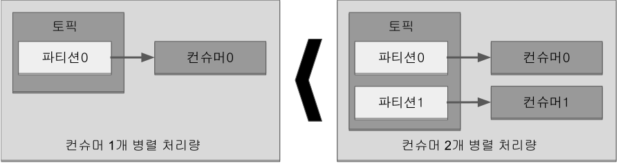
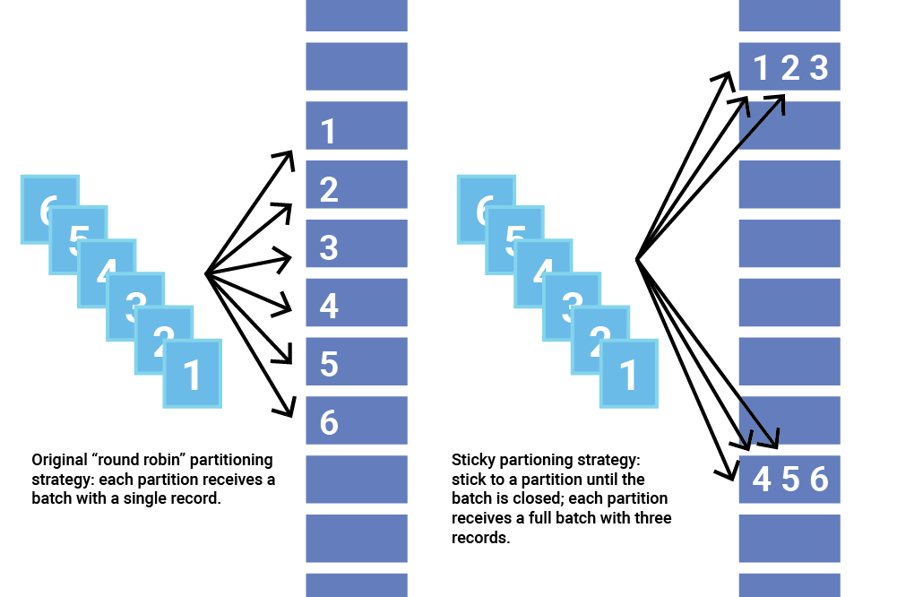

## 3. 카프카 기본 개념 설명

### 3.1 카프카 브로커·클러스터·주키퍼

브로커: 카프카 클라이언트와 데이터를 주고받기 위해 사용하는 주체이자,
데이터를 분산 저장하여 장애가 발생하더라도 안전하게 사용할 수 있도록 도와주는 애플리케이션

데이터를 안전하게 보관하고 처리하기 위해 3대 이상의 브로커 서버를 1개의 클러스터로 묶어서 운영 +
카프카 클러스터로 묶인 브로커들은 프로듀서가 보낸 데이터를 안전하게 분산 저장하고 복제하는 역할을 수행

**데이터 저장, 전송**

프로듀서로부터 데이터를 전달받으면 카프카 브로커는 프로듀서가 요청한 토픽의 파티션에 데이터를 저장하고
컨슈머가 데이터를 요청하면 파티션에 저장된 데이터를 전달

프로듀서로부터 전달된 데이터는 파일 시스템에 저장

.#1 Kafka dataDir, config.server.properties - log.dir 옵션
```
$ ls /tmp/kafka-1-logs/
__consumer_offsets-0   __consumer_offsets-27  __consumer_offsets-42      log-start-offset-checkpoint       test-2
__consumer_offsets-12  __consumer_offsets-3   __consumer_offsets-45      meta.properties                   test-3
__consumer_offsets-15  __consumer_offsets-30  __consumer_offsets-48      recovery-point-offset-checkpoint
__consumer_offsets-18  __consumer_offsets-33  __consumer_offsets-6       replication-offset-checkpoint
__consumer_offsets-21  __consumer_offsets-36  __consumer_offsets-9       test-0
__consumer_offsets-24  __consumer_offsets-39  cleaner-offset-checkpoint  test-1
```

.#2 Partition
```
$ ls /tmp/kafka-1-logs/test-0/
00000000000000000000.index  00000000000000000000.timeindex  partition.metadata
00000000000000000000.log    leader-epoch-checkpoint
```

. log.dir 에 지정한 경로에 데이터를 저장 +
토픽 이름과 파티션 번호의 조합으로 하위 디렉토리를 생성하여 데이터 저장

. test 토픽의 0번 파티션 데이터 +
- log: 메시지와 메타데이터 +
- index: 메시지의 오프셋을 인덱싱한 정보
- timeindex: 메시지에 포함된 timestamp값을 기준으로 인덱싱한 정보 +
카프카 0.10.0.0 버전 이후로 메시지에는 timestamp 값이 포함. timestamp 값은 브로커가 적재한 데이터를 삭제하거나 압축하는데 사용

카프카는 메모리나 데이터베이스에 저장하지 않으며 따로 캐시메모리를 구현하여 사용하지도 않는다. +
카프카는 페이지 캐시(page cache)를 사용하여 디스크 입출력 속도를 높인다. +

페이지 캐시란 OS에서 파일 입출력의 성능 향상을 위해 만들어 놓은 메모리 영역 +
한번 읽은 파일의 내용은 메모리의 페이지 캐시 영역에 저장. 추후 동일한 파일의 접근이 일어나면 디스크에서 읽지 않고 메모리에서 직접 읽는 방식

이러한 특징 때문에 카프카 브로커를 실행하는데 힙 메모리 사이즈를 크게 설정할 필요가 없다.

**데이터 복제, 싱크**

데이터 복제(replication)은 카프카를 장애 허용 시스템(fault tolerant system)으로 동작하도록 하는 원동력 +
복제의 이유는 클러스터로 묶인 브로커 중 일부에 장애가 발생하더라도 데이터를 유실하지 않고 안전하게 사용하기 위함.

카프카의 데이터 복제 단위는 파티션, 토픽을 생성할 때 파티션을 복제 개수(replication factor) 설정 +
옵션을 설정하지 않으면 브로커에 설정된 옵션값 사용 +
최소값은 1(복제 없음)이고 최대값은 브로커 개수

.토픽의 파티션의 복제 개수가 3인 경우


복제된 파티션은 리더(leader)와 팔로워(follower)로 구성

- 리더(leader): 프로듀서 또는 컨슈머와 직접 통신하는 파티션
- 팔로워: 복제 데이터를 가지고 있는 파티션

팔로워 파티션들은 리더 파티션의 오프셋을 확인하여 현재 자신이 가지고 있는 오프셋과 차이나 나는 경우 리더 파티션으로부터 데이터를 가져와서 자신의 파티션에 저장하는데, 이 과정이 '복제(replication)'

복제 개수만큼의 저장 용량이 증가한다는 단점이 존재. +
그러나 복제를 통해 데이터를 안전하게 사용할 수 있다는 강력한 장점 때문에 카프카를 운영할 때는 2 이상의 복제 개수를 정하는 것이 중요.

.브로커 0에 장애가 발생한 경우
image:imgs/replication fault.svg[Static, 800]

브로커가 다운되면 해당 브로커에 있는 리더 파티션을 사용할 수 없기 때문에 팔로워 파티션 중 하나가 리더 파티션 지위를 넘겨받음.
이를 통해 데이터가 유실되지 않고 컨슈머나 프로듀서와 데이터를 주고받도록 동작.


- 복제개수 1 또는 2: 데이터가 일부 유실되어도 무관하고 데이터 처리 속도가 중요
- 복제개수 3: 유실이 일어나면 안 되는 데이터 (최대 2개의 브로커에서 동시에 장애 발생 대응)

**컨트롤러(controller)**

클러스터의 브로커 중 한 대가 컨트롤러 역할을 수행. +
다른 브로커의 상태를 체크하고 브로커가 클러스터에서 빠지는 경우 해당 브로커에 존재하는 리더 파티션을 재분배. +
컨트롤러 역할을 하는 브로커에 장애가 생기면 다른 브로커가 컨트롤러 역할 수행.

**데이터 삭제**

카프카는 컨슈머가 데이터를 가져가더라도 토픽의 데이터는 삭제되지 않음. +
또한, 컨슈머나 프로듀서가 데이터 삭제를 요청할 수 없음. 브로커만 데이터 삭제 가능.

데이터 삭제는 '로그 세그먼트(log segment)' 파일 단위로 이루어짐. +
세그먼트에는 다수의 데이터가 들어 있기 때문에 일반 데이터베이스처럼 특정 데이터를 선별해서 삭제 불가.

세그먼트는 데이터가 쌓이는 동안 파일 시스템으로 열려있으며
카프카 브로커의 log.segment.bytes 또는 log.segment.ms 옵션이 충족되면 세크먼트 파일이 닫힘. 기본값은 1GB. +
너무 작은 용량을 설정하면 데이터들을 저장하는 동안 세그먼트 파일을 자주 여닫음으로써 부하가 발생할 수 있으므로 주의.

닫힌 세그먼트 파일은 log.retention.bytes 또는 log.retention.ms 옵션을 넘어가면 삭제. +
닫힌 세그먼트 파일을 체크하는 간격은 log.retention.check.interval.ms를 따름.

카프카는 데이터를 삭제하지 않고 메시지 키를 기준으로 오래된 데이터를 압축하는 정책도 가능. 토픽 압축 정책은 챕터 4.

**컨슈머 오프셋 저장**

컨슈머 그룹은 토픽이 특정 파티션으로부터 데이터를 가져가서 처리하고 이 파티션의 어느 레코드까지 가져갔는지 확인하기 위해 오프셋을 커밋. +
커밋한 오프셋은 __consumer_offsets 토픽에 저장. 여기에 저장된 오프셋을 토대로 컨슈머 그룹은 다음 레코드를 가져가서 처리.

**코디네이터(coordinator)**

클러스터의 브로커 중 한 대가 코디네이터 역할을 수행. +
컨슈머 그룹의 상태를 체크하고 파티션을 컨슈머와 매칭되도록 분배. +
컨슈머가 컨슈머 그룹에서 빠지면 매칭되지 않은 파티션을 정상 동작하는 컨슈머로 할당하여 끊임없이 데이터가 처리되도록 도움. +
리밸런스(rebalance): 파티션을 컨슈머로 재할당하는 과정

**주키퍼(Zookeeper)**

카프카의 메타데이터 관리

주키퍼 쉘: bin/zookeeper-sheel.sh

```
# 1
$ ./bin/zookeeper-shell.sh 127.0.0.1:2181/test-kafka
Connecting to 127.0.0.1:2181/test-kafka
Welcome to ZooKeeper!
JLine support is disabled

WATCHER::

WatchedEvent state:SyncConnected type:None path:null
# 2
ls /
[admin, brokers, cluster, config, consumers, controller, controller_epoch, feature, isr_change_notification, latest_producer_id_block, log_dir_event_notification]
# 3
ls /brokers/ids
[1, 2, 3]
# 4
get /brokers/ids/1
{"features":{},"listener_security_protocol_map":{"PLAINTEXT":"PLAINTEXT"},"endpoints":["PLAINTEXT://127.0.0.1:9092"],"jmx_port":-1,"port":9092,"host":"127.0.0.1","version":5,"timestamp":"1647963248963"}
# 5
get /controller
{"version":1,"brokerid":1,"timestamp":"1647963249598"}
# 6
ls /brokers/topics
[__consumer_offsets, test]
```

. zookeeper-shell.sh 명령어와 127.0.0.1:1281/test-kafka 옵션을 사용하여 주키퍼에 접속. +
주키퍼 쉘을 통해 znode를 조회하고 수정 가능.
. test-kafka znode의 하위 znode들을 확인.
. 브로커 id 목록 확인
. 1번 브로커 정보 확인. 보안 규칙, jms port, host, port 등
. 컨트롤러(controller) 브로커 확인
. 토픽 목록 조회. +
__consumer_offsets 토픽은 카프카 내부에서 컨뮤서 오프셋을 저장하기 위한 용도

.3개의 카프카 클러스터가 1개의 주키퍼와 연결되어 운영


카프카 클러스터로 묶인 브로커들은 동일한 경로의 주키퍼 경로로 선언. +
만약 클러스터를 여러 개로 운영한다면 한 개의 주키퍼에 다수의 카프카 클러스터를 연결해서 사용 가능.

[TIP]
====
**주키퍼에서 다수의 카프카 클러스터를 사용하는 방법**

주키퍼의 서로 다른 znode에 카프카 클러스터들을 설정하면 된다. +
znode란 주키퍼에서 사용하는 데이터 저장 단위이다.
마치 파일 시스템처럼 znode 간에 계층 구조를 가진다.
1개의 znode에는 n개의 하위 znode가 존재하고 계속해서 tree 구조로 znode가 존재할 수 있다. +
2개 이상의 카프카 클러스터를 구축할 때는 root znode(최상위 znode)가 아닌 한 단계 아래의 znode를 카프카 브로커 옵션으로 지정하도록 한다.
각기 다른 하위 znode로 설정된 서로 다른 카프카 클러스터는 각 클러스터의 데이터에 영향을 미치지 않고 정상 동작한다.

주키퍼 옵션 정의 예제

* 파이프라인용 카프카 클러스터: zookeeper.connect=localhost:2181,localhost:2182,localhost:2183/pipeline
* 실시간 추천용 카프카 클러스터: zookeeper.connect=localhost:2181,localhost:2182,localhost:2183/recommend
====

### 3.2 토픽과 파티션

토픽(topic) : 데이터를 구분하는 단위. 토픽은 1개 이상의 파티션을 소유. +
파티션에는 프로듀서가 보낸 데이터들이 저장되는데 이 데이터가 '레코드(record)'.

.프로듀서가 전송한 레코드는 파티션에 저장된다.


파티션은 카프카의 병렬처리의 핵심 +
그룹으로 묶인 컨슈머들이 레코드를 병렬로 처리할 수 있도록 매칭

컨슈머의 처리량이 한정된 상황에서 많은 레코드를 병렬로 처리하는 가장 좋은 방법은 컨슈머의 개수를 늘려 스케일 아웃하는 것 +
컨슈머 개수를 늘림과 동시에 파티션 개수도 늘리면 처리량이 증가하는 효과를 볼 수 있음.

.파티션 개수와 컨슈머 개수를 늘려서 처리량을 늘린다


파티션은 큐(queue)와 비슷한 구조. +
First-in-first-out(FIFO) 구조와 같이 먼저 들어간 레코드는 컨슈머가 먼저 가져감. +
다만, 일반적인 큐는 데이터를 가져가면(pop) 레코드를 삭제하지만 카프카에서는 삭제하지 않음. +
파티션의 레코드는 컨슈머가 가져가는 것과 별개로 관리. +
이러한 특징 때문에 토픽의 레코드는 다양한 목적을 가진 여러 컨슈머 그룹들이 토픽의 데이터를 여러 번 가져가는 것이 가능.

**토픽 이름 제약 조건**

* 빈 문자열 불가능
* 마침표 하나(.) 또는 마침표 둘(..) 불가능
* 249자 미만
* 영어 대소문자와 숫자 0부터 9, 마침표(.), 언더바(_), 하이픈(-) 조합 : 이 외 문자열은 불가
* 내부 로직 관리 목적인 2개 토픽(__consumer_offsets, __transaction_state) 이름 불가
* 마침표(.)와 언더바(_) 동시 사용 불가
* 기존 토픽 이름의 마침표(.)나 언더바(_)를 언더바(_)나 마침표(.) 변경한 것이 신규 토픽 이름과 동일하면 생성 불가. +
예) to.pic 이름의 토픽이 존재한다면 to_pic 이름의 토픽 생성 불가

**의미 있는 토픽 이름 작명 방법**

토픽 이름은 데이터의 얼굴.

토픽 이름에는 영어 대소문자 외에  마침표(.), 언더바(_), 하이픈(-) 사용 가능 +
토픽 이름 작성 시 구분자로 이 문자들을 사용하면 편리하게 읽기 가능. +
프로듀서나 컨슈머에서 대소문자를 구분하여 처리. +
휴먼에러(human error)로 인한 실수 방지를 위해 대문자와 소문자를 섞어서 쓰는 카멜케이스(CamelCase) 보다는 +
케밥케이스(kebab-case) 또는 스네이크 표기법(snake_case)와 같이 소문자를 쓰되 구분자로 특수문자를 조합하여 사용.

[NOTE]
====
**토픽 작명의 템플릿과 예시**

* **<환경>.<팀-명>.<애플리케이션-명>.<메시지-타입>** +
예시) prd.marketing-team.sms-platform.json
* **<프로젝트-명>.<서비스-명>.<환경>.이벤트-명>** +
예시) commerce.payment.prd.notification
* **<환경>.<서비스-명>.<JIRA-번호>.<메시지-타입>** +
예시) dev.email-sender.jira-1234.email-vo-custom
* **<카프카-클러스터-명>.<환경>.<서비스-명>.<메시지-타입>** +
예시) aws-kafka.live.marketing-platform.json

====

중요한 것은 토픽 이름에 대한 규칙을 사전에 정의하고 구성원들이 그 규칙을 잘 따르는 것 +
규칙을 정해도 따르지 않으면 예측하지 못한 방향으로 토픽 이름이 생성될 것이고 이것들은 기술 부채(technical debt)로 남음. +
카프카는 토픽 이름 변경을 지원하지 않으므로 이름을 변경하기 위해서는 삭제 후 다시 생성하는 것 외에는 방법이 없음.

### 3.3 레코드

레코드는 타임스탬프, 메시지 키, 메시지 값, 오프셋으로 구성 +
프로듀서가 생성한 레코드가 브로커로 전송되면 오프셋과 타임스탬프가 지정되어 저장. +
브로커에 적재된 레코드는 수정할 수 없고 로그 리텐션 기간 또는 용량에 따라서 삭제.

타임스탬프는 브로커 기준 유닉스 시간이 설정. +
컨슈머는 레코드의 타임스탬프를 토대로 레코드가 언제 브로커에 적재되었는지 확인 가능. +
다만, 프로듀서가 레코드를 생성할 때 임의의 타임스탬프 값을 설정할 수 있고, 카프카 0.10.0.0 버전 이상에서만 타임스탬프 사용 가능.

메시지 키는 메시지 값을 순서대로 처리하거나 메시지 값의 종류를 나타내기 위해 사용.
메시지 키를 사용하면 프로듀서가 토픽에 레코드를 전송할 때 메시지 키의 해시값을 토대로 파티션을 지정. +
즉, 동일 메시지 키라면 동일 파티션에 저장. 다만, 어느 파티션에 지정될지 알 수 없고 파티션 개수가 변경되면 메시지 키와 파티션 매칭이 변경되므로 주의.

메시지 키를 선언하지 않으면 null로 자동설정. +
메시지 키가 null로 설정된 레코드는 프로듀서 기본 설정 파티셔너에 따라서 파티션에 분배되어 적재.

메시지 값은 실질적으로 처리할 데이터. +
메시지 키와 메시지 값은 직렬화되어 브로커로 전송되기 때문에 컨슈머가 이용할 때는 직렬화한 형태와 동일한 형태로 역직렬화를 수행 필요. +
StringSerializer로 직렬화 했다면, String Deserializer로 역직렬화 해야함.

레코드의 오프셋은 0 이상의 숫자. +
레코드의 오프셋은 직접 지정할 수 없고 브로커에 저장될 때 이전에 전송된 레코드의 오프셋+1 값으로 생성. +
오프셋은 카프카 컨슈머가 데이터를 가져갈 때 사용. +
오프셋을 사용하면 컨슈머 그룹으로 이루어진 카프카 컨슈머들이 파티션의 데이터를 어디까지 가져갔는지 명확히 지정 가능.

### 3.4 카프카 클라이언트

프로듀서, 컨슈머, 어드민

#### 3.4.1 프로듀서 API

프로듀서는 데이터의 시작점 +
카프카에 필요한 데이터를 선언하고 브로커의 특정 토픽의 파티션에 전송 +
데이터를 전송할 때 리더 파티션을 가지고 있는 카프카 브로커와 직접 통신

직렬화: 자바 또는 외부 시스템에서 사용 가능하도록 바이트 형태로 데이터를 변환하는 기술

[NOTE]
====
```
java, gradle 설치 - 바이너리 다운받음 후, 압축 해제 후, 각 폴더의 bin 경로를 PATH에 추가

$ java -version
openjdk version "17.0.2" 2022-01-18
OpenJDK Runtime Environment (build 17.0.2+8-Ubuntu-120.04)
OpenJDK 64-Bit Server VM (build 17.0.2+8-Ubuntu-120.04, mixed mode, sharing)

$ gradle -v

Welcome to Gradle 7.4.1!

Here are the highlights of this release:
 - Aggregated test and JaCoCo reports
 - Marking additional test source directories as tests in IntelliJ
 - Support for Adoptium JDKs in Java toolchains

For more details see https://docs.gradle.org/7.4.1/release-notes.html


------------------------------------------------------------
Gradle 7.4.1
------------------------------------------------------------

Build time:   2022-03-09 15:04:47 UTC
Revision:     36dc52588e09b4b72f2010bc07599e0ee0434e2e

Kotlin:       1.5.31
Groovy:       3.0.9
Ant:          Apache Ant(TM) version 1.10.11 compiled on July 10 2021
JVM:          17.0.2 (Private Build 17.0.2+8-Ubuntu-120.04)
OS:           Linux 5.10.16.3-microsoft-standard-WSL2 amd64
```
====

**카프카 프로듀서 프로젝트 생성**
gradle를 이용하여 프로젝트 초기화

```
gradle init --type java-application --dsl groovy --test-framework junit-jupiter
mv app/* .
rmdir app
```

```
$ gradle init --type java-application --dsl groovy --test-framework junit-jupiter

Generate build using new APIs and behavior (some features may change in the next minor release)? (default: no) [yes, no]
 no

Project name (default: kafka-producer): kafka-producer
Source package (default: kafka.producer): com.moss.kafka.producer

> Task :init
Get more help with your project: https://docs.gradle.org/7.4.1/samples/sample_building_java_applications.html

BUILD SUCCESSFUL in 23s
2 actionable tasks: 2 executed
```

초기화 후 폴더 구조
```
.
├── build.gradle       # 1
├── gradle             # 2
│   └── wrapper
│       ├── gradle-wrapper.jar
│       └── gradle-wrapper.properties
├── gradlew
├── gradlew.bat
├── settings.gradle
└── src
    ├── main
    │   ├── java       # 3
    │   │   └── com
    │   │       └── moss
    │   │           └── kafka
    │   │               └── producer
    │   │                   └── App.java
    │   └── resources
    └── test
        ├── java
        │   └── com
        │       └── moss
        │           └── kafka
        │               └── producer
        │                   └── AppTest.java
        └── resources
```

. 프로젝트를 빌드하기 위한 작업이나 디펜더시를 정의 가능
. 그래들(gradle)로 생성한 프로젝트의 구조를 선언. 주로 멀티 프로젝트 구조 정의
. 코드가 위치할 디렉토리

**settings.gradle, build.gradle 수정**

link:https://docs.confluent.io/platform/current/clients/index.html[Kafka Clients]

.settings.gradle
```
rootProject.name = 'kafka-producer'
```

.build.gradle
```
plugins {
    id 'java'
}

group 'com.moss.kafka'
version '1.0'

repositories {
    mavenCentral()
}

dependencies {
    implementation 'org.apache.kafka:kafka-clients:3.1.0'
    implementation 'org.slf4j:slf4j-simple:1.7.36'

    testImplementation 'org.junit.jupiter:junit-jupiter:5.8.1'
}

tasks.named('test') {
    useJUnitPlatform()
}

```

**src/main/java/com/moss/kafka/producer/App.java 수정**

.App.java
```
package com.moss.kafka.producer;

import org.apache.kafka.clients.producer.KafkaProducer;
import org.apache.kafka.clients.producer.ProducerConfig;
import org.apache.kafka.clients.producer.ProducerRecord;
import org.apache.kafka.common.serialization.StringSerializer;
import org.slf4j.Logger;
import org.slf4j.LoggerFactory;

import java.util.Properties;

public class App {
    private final static Logger logger = LoggerFactory.getLogger(App.class);
    private final static String TOPIC_NAME = "test";  // 1
    private final static String BOOTSTRAP_SERVERS = "localhost:9092,localhost:9093,localhost:9094";  // 2

    public static void main(String[] args) {
        Properties configs = new Properties();  // 3
        configs.put(ProducerConfig.BOOTSTRAP_SERVERS_CONFIG, BOOTSTRAP_SERVERS);
        configs.put(ProducerConfig.KEY_SERIALIZER_CLASS_CONFIG, StringSerializer.class.getName());  // 4
        configs.put(ProducerConfig.VALUE_SERIALIZER_CLASS_CONFIG, StringSerializer.class.getName());  // 4

        KafkaProducer<String, String> producer = new KafkaProducer<>(configs);  // 5

        String messageValue = "testMessage";  // 6
        ProducerRecord<String, String> record = new ProducerRecord<>(TOPIC_NAME, messageValue);  /7
        producer.send(record);  // 8
        logger.info("{}", record);
        producer.flush();  // 9
        producer.close();  // 10
    }
}
```

설명 추가
```
package com.moss.kafka.producer;

import org.apache.kafka.clients.producer.KafkaProducer;
import org.apache.kafka.clients.producer.ProducerConfig;
import org.apache.kafka.clients.producer.ProducerRecord;
import org.apache.kafka.common.serialization.StringSerializer;
import org.slf4j.Logger;
import org.slf4j.LoggerFactory;

import java.util.Properties;

public class App {
    private final static Logger logger = LoggerFactory.getLogger(App.class);
    // 1. 토픽 이름
    private final static String TOPIC_NAME = "test";
    // 2. 카프카 클러스터 서버 IP:port 목록
    private final static String BOOTSTRAP_SERVERS = "localhost:9092,localhost:9093,localhost:9094";

    public static void main(String[] args) {
        // 3. KafkaProducer 옵션
        // 필수 옵션은 반드시 선언, 선택 옵션은 선택하지 않으면 기본 옵션값으로 동작, 선택 옵션의 기본 값을 알아야 한다.
        Properties configs = new Properties();
        configs.put(ProducerConfig.BOOTSTRAP_SERVERS_CONFIG, BOOTSTRAP_SERVERS);
        // 4. 메시지 키, 메시지 값 직렬화 클래스 선언
        configs.put(ProducerConfig.KEY_SERIALIZER_CLASS_CONFIG, StringSerializer.class.getName());
        configs.put(ProducerConfig.VALUE_SERIALIZER_CLASS_CONFIG, StringSerializer.class.getName());

        // 5. Properties와 함께 KafkaProducer 인스턴스 생성. producer 인스턴스는 ProducerRecord 전송 시 사용.
        KafkaProducer<String, String> producer = new KafkaProducer<>(configs);

        // 6. 메시지 값 선언
        String messageValue = "testMessage";
        // 7. 브로커로 데이터를 보내기 위해 ProducerRecord 생성.
        // ProducerRecord 생성자는 여러 개. 생성자 개수에 따라 오버로딩(overloading) 되어 생성
        // 여기서는 토픽 이름과 메시지 값만 선언. 메시지 키는 null로 설정되어 전송
        // ProducerRecord의 2개의 제네릭 값은 각각 메시지 키와 메시지 값 타입을 의미.
        // 메시지 키와 메시지 값의 타입은 직렬화 클래스와 동일하게 설정
        ProducerRecord<String, String> record = new ProducerRecord<>(TOPIC_NAME, messageValue);
        // 8. recode를 producer의 send() 메서드로 전송
        // 프로듀서에서 send()는 즉각 전송하지 않고, record를 프로듀서 내부에 가지고 있다가 배치 형태로 브로커에 전송.
        // 이러한 전송 방식을 '배치 전송'이라 부름. 배치 전송을 통해 카프카는 타 메시지 플랫폼과 차별화된 전송 속도를 가짐.
        producer.send(record);
        logger.info("{}", record);
        // 9. flush()를 통해 프로듀서 내부 버퍼에 가지고 있던 레코드 배치를 브로커로 즉각 전송
        producer.flush();
        // 10. 애플리케이션 종료하기 전에 close() 메서드를 호출하여 producer 인스턴스의 리소스들을 안전하게 종료.
        producer.close();
    }
}
```

실제 운영환경에서는 추가 로직들을 포함.

* 프로듀서 인스턴스를 통해 데이터가 카프카 보러커까지 정상적으로 전송되었는지 확인하는 로직
* 환경에 따른 추가적인 프로듀서 선택 옵션들의 설정 등

**test 토픽 생성**

test 토픽이 생성되었는지 확인하고 생성되지 않았으면 생성한다.

.토픽 목록 확인
```
$ bin/kafka-topics.sh --list --bootstrap-server localhost:9092,localhost:9093,localhost:9094
__consumer_offsets
test
```

.토필 생성 : test 토픽이 없는 경우
```
$ bin/kafka-topics.sh --bootstrap-server localhost:9092,localhost:9093,localhost:9094 \
  --create \
  --topic test \
  --partitions 3
Created topic test.
```

**프로그램 실행**
'./gradlew run' 명령어로 실행

```
$ ./gradlew run

> Task :run
#### 1 ####
[main] INFO org.apache.kafka.clients.producer.ProducerConfig - ProducerConfig values:
        acks = -1
        batch.size = 16384
        bootstrap.servers = [localhost:9092, localhost:9093, localhost:9094]
        buffer.memory = 33554432
        client.dns.lookup = use_all_dns_ips
        client.id = producer-1
        compression.type = none
        connections.max.idle.ms = 540000
        delivery.timeout.ms = 120000
        enable.idempotence = true
        interceptor.classes = []
        key.serializer = class org.apache.kafka.common.serialization.StringSerializer
        linger.ms = 0
        max.block.ms = 60000
        max.in.flight.requests.per.connection = 5
        max.request.size = 1048576
        metadata.max.age.ms = 300000
        metadata.max.idle.ms = 300000
        metric.reporters = []
        metrics.num.samples = 2
        metrics.recording.level = INFO
        metrics.sample.window.ms = 30000
        partitioner.class = class org.apache.kafka.clients.producer.internals.DefaultPartitioner
        receive.buffer.bytes = 32768
        reconnect.backoff.max.ms = 1000
        reconnect.backoff.ms = 50
        request.timeout.ms = 30000
        retries = 2147483647
        retry.backoff.ms = 100
        sasl.client.callback.handler.class = null
        sasl.jaas.config = null
        sasl.kerberos.kinit.cmd = /usr/bin/kinit
        sasl.kerberos.min.time.before.relogin = 60000
        sasl.kerberos.service.name = null
        sasl.kerberos.ticket.renew.jitter = 0.05
        sasl.kerberos.ticket.renew.window.factor = 0.8
        sasl.login.callback.handler.class = null
        sasl.login.class = null
        sasl.login.connect.timeout.ms = null
        sasl.login.read.timeout.ms = null
        sasl.login.refresh.buffer.seconds = 300
        sasl.login.refresh.min.period.seconds = 60
        sasl.login.refresh.window.factor = 0.8
        sasl.login.refresh.window.jitter = 0.05
        sasl.login.retry.backoff.max.ms = 10000
        sasl.login.retry.backoff.ms = 100
        sasl.mechanism = GSSAPI
        sasl.oauthbearer.clock.skew.seconds = 30
        sasl.oauthbearer.expected.audience = null
        sasl.oauthbearer.expected.issuer = null
        sasl.oauthbearer.jwks.endpoint.refresh.ms = 3600000
        sasl.oauthbearer.jwks.endpoint.retry.backoff.max.ms = 10000
        sasl.oauthbearer.jwks.endpoint.retry.backoff.ms = 100
        sasl.oauthbearer.jwks.endpoint.url = null
        sasl.oauthbearer.scope.claim.name = scope
        sasl.oauthbearer.sub.claim.name = sub
        sasl.oauthbearer.token.endpoint.url = null
        security.protocol = PLAINTEXT
        security.providers = null
        send.buffer.bytes = 131072
        socket.connection.setup.timeout.max.ms = 30000
        socket.connection.setup.timeout.ms = 10000
        ssl.cipher.suites = null
        ssl.enabled.protocols = [TLSv1.2, TLSv1.3]
        ssl.endpoint.identification.algorithm = https
        ssl.engine.factory.class = null
        ssl.key.password = null
        ssl.keymanager.algorithm = SunX509
        ssl.keystore.certificate.chain = null
        ssl.keystore.key = null
        ssl.keystore.location = null
        ssl.keystore.password = null
        ssl.keystore.type = JKS
        ssl.protocol = TLSv1.3
        ssl.provider = null
        ssl.secure.random.implementation = null
        ssl.trustmanager.algorithm = PKIX
        ssl.truststore.certificates = null
        ssl.truststore.location = null
        ssl.truststore.password = null
        ssl.truststore.type = JKS
        transaction.timeout.ms = 60000
        transactional.id = null
        value.serializer = class org.apache.kafka.common.serialization.StringSerializer

#### 2 ####
[main] INFO org.apache.kafka.common.utils.AppInfoParser - Kafka version: 3.1.0
[main] INFO org.apache.kafka.common.utils.AppInfoParser - Kafka commitId: 37edeed0777bacb3
[main] INFO org.apache.kafka.common.utils.AppInfoParser - Kafka startTimeMs: 1648054717171
[kafka-producer-network-thread | producer-1] INFO org.apache.kafka.clients.Metadata - [Producer clientId=producer-1] Resetting the last seen epoch of partition test-0 to 21 since the associated topicId changed from null to n3nYAgNIQ8aIcxrMbcn24A
[kafka-producer-network-thread | producer-1] INFO org.apache.kafka.clients.Metadata - [Producer clientId=producer-1] Resetting the last seen epoch of partition test-2 to 16 since the associated topicId changed from null to n3nYAgNIQ8aIcxrMbcn24A
[kafka-producer-network-thread | producer-1] INFO org.apache.kafka.clients.Metadata - [Producer clientId=producer-1] Resetting the last seen epoch of partition test-3 to 21 since the associated topicId changed from null to n3nYAgNIQ8aIcxrMbcn24A
[kafka-producer-network-thread | producer-1] INFO org.apache.kafka.clients.Metadata - [Producer clientId=producer-1] Resetting the last seen epoch of partition test-1 to 16 since the associated topicId changed from null to n3nYAgNIQ8aIcxrMbcn24A
[kafka-producer-network-thread | producer-1] INFO org.apache.kafka.clients.Metadata - [Producer clientId=producer-1] Cluster ID: 4qcm1av-QEm2eFZVApehnw

#### 3 ####
[main] INFO com.moss.kafka.producer.App - ProducerRecord(topic=test, partition=null, headers=RecordHeaders(headers = [], isReadOnly = true), key=null, value=testMessage, timestamp=null)
[main] INFO org.apache.kafka.clients.producer.KafkaProducer - [Producer clientId=producer-1] Closing the Kafka producer with timeoutMillis = 9223372036854775807 ms.
[main] INFO org.apache.kafka.common.metrics.Metrics - Metrics scheduler closed
[main] INFO org.apache.kafka.common.metrics.Metrics - Closing reporter org.apache.kafka.common.metrics.JmxReporter
[main] INFO org.apache.kafka.common.metrics.Metrics - Metrics reporters closed
[main] INFO org.apache.kafka.common.utils.AppInfoParser - App info kafka.producer for producer-1 unregistered

BUILD SUCCESSFUL in 5m 59s
2 actionable tasks: 2 executed
```

. ProducerConfig values : 카프카 프로듀서 구동 시 설정한 옵션
. Kafka version: 3.1.0 : 카프카 버전
. ProducerRecord(topic=test, partition=null, headers=RecordHeaders(headers = [], isReadOnly = true), key=null, value=testMessage, timestamp=null) +
전송한 ProducerRecord. 생성 시 메시지 키를 설정하지 않았기에 null로 설정된 것 확인.

.kafka-console-consumer 로 데이터 확인
```
$ bin/kafka-console-consumer.sh --bootstrap-server localhost:9092,localhost:9093,localhost:9094 \
  --topic test \
  --from-beginning
...
testMessage
```

**프로듀서 중요 개념**

프로듀서는 카프카 브로커로 데이터를 전송할 때 내부적으로 파티셔너, 배치 생성 단계를 거침. +
ProducerRecord 인스턴스는 필수 파라미터인 토픽과 메시지 값만 설정 +
아래의 값을 추가로 설정할 수 있다.

* 파티션 번호
* 타임스탬프
* 메시지 키

.ProducerRecord 생성자 목록
```
public ProducerRecord(String topic, Integer partition, Long timestamp, K key, V value, Iterable<Header> headers)
public ProducerRecord(String topic, Integer partition, Long timestamp, K key, V value)
public ProducerRecord(String topic, Integer partition, K key, V value, Iterable<Header> headers)
public ProducerRecord(String topic, Integer partition, K key, V value)
public ProducerRecord(String topic, K key, V value)
public ProducerRecord(String topic, V value)
```

KafkaProducer.send() 메서드를 호출하면 ProducerRecord는 파티셔너(partitioner)에서 토픽의 어느 파티션으로 전송될 것인지 정해짐.
KafkaProducer 생성 시 파티셔너를 지정하지 않으면 DefaultPartitoner을 설정.

파티셔너에 의해 구분된 레코드는 데이터를 전송하기 전에 어큐뮬레이터(accumulator)에 데이터를 버퍼로 쌓아놓고 발송. +
버퍼로 쌓인 데이터는 배치로 묶어서 전송함으로써 카프카의 프로듀서 처리량을 향상시키는 데에 상당한 도움을 줌.

Partitioner (3.1.0 버전 기준)

* DefaultPartitioner (Default) link:https://github.com/a0x8o/kafka/blob/master/clients/src/main/java/org/apache/kafka/clients/producer/internals/DefaultPartitioner.java[SourceCode] : +
Key 존재 시 Utils.murmur2() 해쉬 값 사용, Key 미존재 시 StickyPartitionCache 사용
* UniformStickyPartitioner link:https://github.com/a0x8o/kafka/blob/master/clients/src/main/java/org/apache/kafka/clients/producer/UniformStickyPartitioner.java[SourceCode] :
항상 StickyPartitionCache 사용
* RoundRobinPartitioner link:https://github.com/a0x8o/kafka/blob/master/clients/src/main/java/org/apache/kafka/clients/producer/RoundRobinPartitioner.java[SourceCode] :
항상 RoundRobin

link:https://www.confluent.io/blog/apache-kafka-producer-improvements-sticky-partitioner/[Apache Kafka Producer Improvements with the Sticky Partitioner]


RoundRobinPartitioner는 같은 Topic의 동일 Batch 내 레코드여도 매번 다른 파티션이 선택하지만, +
StickyPartitioner는 같은 Topic의 동일 batch 내 레코드면 같은 파티션을 선택. +
다음 배치에는 이전 파티션과 아닌 파티션을 랜덤하게 선택.

```
public class StickyPartitionCache {
    private final ConcurrentMap<String, Integer> indexCache;
    public StickyPartitionCache() {
        this.indexCache = new ConcurrentHashMap<>();
    }

    public int partition(String topic, Cluster cluster) {
        Integer part = indexCache.get(topic);
        if (part == null) {
            return nextPartition(topic, cluster, -1);
        }
        return part;
    }

    public int nextPartition(String topic, Cluster cluster, int prevPartition) {
        List<PartitionInfo> partitions = cluster.partitionsForTopic(topic);
        Integer oldPart = indexCache.get(topic);
        Integer newPart = oldPart;
        // Check that the current sticky partition for the topic is either not set or that the partition that
        // triggered the new batch matches the sticky partition that needs to be changed.
        if (oldPart == null || oldPart == prevPartition) {
            List<PartitionInfo> availablePartitions = cluster.availablePartitionsForTopic(topic);
            if (availablePartitions.size() < 1) {
                Integer random = Utils.toPositive(ThreadLocalRandom.current().nextInt());
                newPart = random % partitions.size();
            } else if (availablePartitions.size() == 1) {
                newPart = availablePartitions.get(0).partition();
            } else {
                while (newPart == null || newPart.equals(oldPart)) {
                    int random = Utils.toPositive(ThreadLocalRandom.current().nextInt());
                    newPart = availablePartitions.get(random % availablePartitions.size()).partition();
                }
            }
            // Only change the sticky partition if it is null or prevPartition matches the current sticky partition.
            if (oldPart == null) {
                indexCache.putIfAbsent(topic, newPart);
            } else {
                indexCache.replace(topic, prevPartition, newPart);
            }
            return indexCache.get(topic);
        }
        return indexCache.get(topic);
    }
}
```

사용자 지정 파티셔너를 생성하기 위해서는 Partitioner 인터페이스를 구현.

파티셔너를 통해 파티션이 지정된 데이터는 어큐뮬레이터에 버퍼로 쌓임. +
센더(sender) 스레드는 어큐뮬레이터에 쌓인 배치 데이터를 가져가 카프카 브로커로 전송.

브로커로 전송 시 압축 방식을 정할 수 있음. +
압축 옵션을 정하지 않으면 압축이 되지 않은 상태로 전송 +
압축 옵션: gzip, snappy, lz4, zstd

압축을 하면 데이터 전송 시 네트워크 처리량에 이득을 볼 수 있지만 압축을 하는 데에 CPU 또는 메모리 리소스를 사용하므로 사용환경에 따라 적절한 압축 옵션을 사용하는 것이 중요.
또한, 프로듀서에서 압축한 메시지는 컨슈머 애플리케이션이 압축을 풀게 되는데 이때도 컨슈머 애플리케이션 리소스가 사용되는 점을 주의.

[NOTE]
====
압축 참고: link:http://happinessoncode.com/2019/01/18/kafka-compression-ratio/[Kafka 메시지 압축률 안나와서 고생한 이야기]

* 카프카를 사용하고자 한다면 압축을 고려해보자.
* 생각보다 압축률이 나오지 않는다면 linger.ms와 batch.size를 조절해보자.

.프로듀서
|===
|type|CPU 사용률|처리 시간|브로커 디스크 용량|압축률

|none|1.00|1.00|1.00|1.00
|gzip|1.70|0.84|0.31|3.17
|lz4|1.54|0.61|0.46|2.16
|snappy|1.54|0.60|0.46|2.16
|===

.컨슈머
|===
|type|CPU 사용률|처리시간

|none|1.00|1.00
|gzip|1.54|0.65
|lz4|1.35|0.68
|snappy|1.35|0.72
|===

====

**프로듀서 주요 옵션**

link:https://kafka.apache.org/documentation.html#producerconfigs[Producer Configs] +
link:https://github.com/apache/kafka/blob/trunk/clients/src/main/java/org/apache/kafka/clients/producer/ProducerConfig.java#L316[Default Cofig]

[cols="1,9"]
.필수옵션
|===
|옵션|설명

|bootstrap.servers|브로커 호스트 이름:포트 1개 이상. 2개 이상 입력하면 일부 브로커에 이슈가 발생하더라도 접속하는데 이슈 없도록 설정 가능.
|key.serializer|레코드의 메시지 키를 직렬화하는 클래스
value.serializer|레코드의 메시지 값을 직렬화하는 클래스
|===

[cols="1,9"]
.선택옵션
|===
|옵션|설명

|akcs
a|기본값: all +
프로듀서가 전송한 데이터가 브로커들에 정상적으로 저장되었는지 전송 성공 여부 확인하는 데 사용하는 옵션. 0, 1, -1(all) 중 하나서 설정 가능. +
ㆍ 1 (default): 리더 파티션에 데이터가 저장되면 전송 성공으로 판단 +
ㆍ 0 : 프로듀서가 전송한 즉시 브로커에 데이터 저장 여부와 상관 없이 성공으로 판단 +
ㆍ -1 (or all): 토픽의 min.insync.replicas 개수에 해당하는 리더 파티션과 팔로워 파티션에 데이터가 저장되면 성공으로 판단

|buffer.memory|기본값: 33554432(32MB) +
브로커로 전송할 데이터를 배치에 모으기 위해 설정한 버퍼 메모리량
|retries|기본값: 2147483647 +
프로듀서가 브로커로부터 에러를 받고 난 뒤 재전송을 시도하는 횟수 +
|**batch.size**|기본값: 16384 (16kB) +
배치로 전송할 레코드 최대 용량 +
너무 작게 설정하면 프로듀서가 브로커로 더 자주 보내기 때문에 네트워크 부담 +
너무 크게 설정하면 메모리를 더 많이 사용 +
[개인학습] batch.size는 partition 별로 관리된다. +
```
Requests sent to brokers will contain multiple batches, one for each partition with data available to be sent.
```
|**linger.ms**|기본값: 0 +
배치를 전송하기 전까지 기다리는 최소 시간 +
[개인학습] 프로듀서는 메시지 도착 속도가 메시지 전송 속도보다 빠를 때만 배치로 묶어서 보냄 +
0인 경우 메시지를 바로바로 브로커로 전송할 수 있는 상황에서는 배치가 쌓일 때까지 기다리지 않고 전송 +
기본값이 0이기 때문에 전송 가능하다면 바로 전송되어 레코드들이 배치로 묶이지 않음. +
batch 효율을 높이기 위한 문서상 예제 값은 5 (5ms) +
```
The producer groups together any records that arrive in between request transmissions into a single batched request. Normally this occurs only under load when records arrive faster than they can be sent out.
```
|partitioner.class|기본값: org.apache.kafka.clients.producer.internals.DefaultPartitioner +
레코드를 파티션에 전송할 때 적용하는 파티셔너 클래스
|enable.idempotence
a|기본값: true +
멱등성 프로듀서로 동작 여부 +
[개인학습] true인 경우 필요 조건 +
ㆍ retries : value > 0 (기본값: Integer.MAX_VALUE)
ㆍ acks : all (기본값: all)
|transactional.id|기본값: null +
프로듀서가 레코드를 전송할 때 레코드를 트랜잭션 단위로 묶을지 여부 설정 +
프로듀서의 고유한 트랜잭션 아이디를 설정할 수 있다. 이 값을 설정하면 트랜잭션 프로듀서로 동작 +
자세한 내용은 챕터 4에서 확인
|compression.type
a|기본값: none +
데이터 압축 유형, 사용가능 값은 (none, gzip, snappy, lz4, zstd) +
압축은 배치 단위로 이루어 짐. 이에 효율적인 배치는 효율적 압축률로 이어짐.

연관 주요 설정 +
ㆍ batch.size +
ㆍ linger.ms : 5

link:https://developer.ibm.com/articles/benefits-compression-kafka-messaging/[Message compression in Apache Kafka]

[개인정리] 실시간 데이터(이벤트 등)는 snappy, 아카이브 데이터(로그 등)는 gzip 사용이 유리할 것으로 생각 +
snappy는 반복적인 패턴이 존재하는 경우 효율적. json은 반복적인 패턴이 많기에 snappy가 효율적

|===

**압축 유형(compresssion.type) 비교**

|===
|Compression type|Compression ratio|CPU usage|Compression speed|Network bandwidth usage

|Gzip|Highest|Highest|Slowest|Lowest
|Snappy|Medium|Moderate|Moderate|Medium
|Lz4|Low|Lowest|Fastest|Highest
|Zstd|Medium|Moderate|Moderate|Medium
|===

**IBM 압축 유형별 테스트 결과**

* data: 1000 messages in JSON format with an average size of 10 KB
* total data: 10 MB
* serializer: org.apache.kafka.common.serialization.StringSerialize

|===
|Metrics|Uncompressed|Gzip|Snappy|lz4|Zstd

|Avg latency (ms)|65|10.41|10.1|9.26|10.78
|Disk space (mb)|10|0.92|2.18|2.83|1.47
|Effective compression ratio|1|0.09|0.21|0.28|0.15
|Process CPU usage %|2.35|11.46|7.25|5.89|8.93
|===

정리: 실시간 데이터(이벤트 등)는 snappy, 아카이브 데이터(로그 등)는 gzip

의문: 데이터 크기가 아주 작은 경우에는 Uncompressed가 가장 빠를까?

**메시지 키를 가진 데이터를 전송하는 프로듀서**

.메시지 키 포함된 레코드 생성
```
// Topic, Key, Value
ProducerRecord<String, String> record = new ProducerRecord<>("test", "Pangyo", "23");
```

.레코드 확인
```
$ bin/kafka-console-consumer.sh --bootstrap-server localhost:9092,localhost:9093,localhost:9094 \
  --topic test \
  --property print.key=true \
  --property key.separator="-" \
  --from-beginning
...
null-testMessage
Pangyo-23
```

.파티션 지정
```
// Topic, PartitionNo, Key, Value
ProducerRecord<String, String> record = new ProducerRecord<>("test", 1, "Pangyo", "23");
```

**커스텀 파티셔너를 가지는 프로듀서**

특정 데이터를 가지는 레코드는 특정 파티션으로 보내야 하는 경우 존재 +
기본 파티셔너를 사용할 경우 메시지 키의 해시값을 파티션에 매칭하여 데이터를 전송하므로 어느 파티션에 들어가는지 알 수 없음

Partitioner 인터페이스를 사용하여 사용자 정의 파티셔너를 생성하면 Pangyo라는 값을 가진 메시지 키에 대해서 무조건 파티션 1번으로 지정하도록 설정 가능 +
이 경우 토픽의 파티션 개수가 변경되더라도, Pangyo라는 메시지 키를 가진 데이터를 파티션 1번에 적재

```
package com.moss.kafka.producer;

import org.apache.kafka.clients.producer.Partitioner;
import org.apache.kafka.common.Cluster;
import org.apache.kafka.common.InvalidRecordException;
import org.apache.kafka.common.PartitionInfo;
import org.apache.kafka.common.utils.Utils;

import java.util.List;
import java.util.Map;

public class CustomPartitioner implements Partitioner {
    // # 1
    @Override
    public int partition(String topic, Object key, byte[] keyBytes, Object value, byte[] valueBytes, Cluster cluster) {
        // # 2
        if (keyBytes == null) {
            throw new InvalidRecordException("Need message key");
        }
        // # 3
        if (((String)key).equals("Pangyo")) {
            return 1;
        }

        List<PartitionInfo> partitions = cluster.partitionsForTopic(topic);
        int numPartitions = partitions.size();
        // # 4
        return Utils.toPositive(Utils.murmur2(keyBytes)) % numPartitions;
    }

    @Override
    public void close() { }

    @Override
    public void configure(Map<String, ?> configs) { }
}
```

. partition 메서드에는 레코드를 기반으로 파티션을 정하는 로직을 포함. 반환값은 주어진 레코드가 들어간 파티션 번호
. 레코드에 메시지 키를 지정하지 않은 경우에는 비정상적인 데이터로 간주하고 InvalidRecordException 발생
. 메시지 키가 Pangyo인 경우 파티션 1번으로 지정되도록 1을 반환
. Pangyo가 아닌 메시지 키를 가진 레코드는 해시값을 지정하여 특정 파티션에 매칭되도록 설정

.CustomPartitioner를 설정하여 KafkaProducer 생성
```
Properties configs = new Properties();
...
configs.put(ProducerConfig.PARTITIONER_CLASS_CONFIG, CustomPartitioner.class);

KafkaProducer<String, String> producer = new KafkaProducer<>(configs);
```

**브로커 정상 전송 여부를 확인하는 프로듀서**

KafkaProducer의 send() 메서드는 Future 객체를 반환 +
이 객체는 RecordMetadata의 비동기 결과를 표현, ProducerRecord가 카프카 브로커에 정상적으로 적재되었는지에 대한 데이터를 포함 +
get() 메서드를 사용하면 프로듀서로 보낸 데이터의 결과를 동기적으로 조회 가능

```
ProducerRecord<String, String> record = new ProducerRecord<>(TOPIC_NAME, messageValue);
RecordMetadata metadata = producer.send(record).get();
logger.info(metadata.toString());
```

send()의 결과값은 카프라 브로커로부터 응답을 기다렸다가 브로커로부터 응답이 오면 RecordMetadata 인스턴스를 반환

.Metadata 출력화면, {topic}-{partition}@{offset}
```
[main] INFO com.moss.kafka.producer.App - test-1@11
```

test-1@11

* 토픽 이름: test
* 파티션 번호: 1
* 오프셋 번호: 11

동기로 프로듀서의 전송 결과를 확인하는 것은 빠른 전송에 허들 될 수 있음 +
프로듀서가 전송하고 난 뒤 브로커로부터 전송에 대한 응답 값을 받기 전까지 대기하기 때문

비동기로 결과 확인을 위한 Callback 인터페이스 제공

```
package com.moss.kafka.producer;

import org.apache.kafka.clients.producer.Callback;
import org.apache.kafka.clients.producer.RecordMetadata;
import org.slf4j.Logger;
import org.slf4j.LoggerFactory;

public class ProducerCallback implements Callback {
    private final static Logger logger = LoggerFactory.getLogger(ProducerCallback.class);

    @Override
    public void onCompletion(RecordMetadata metadata, Exception exception) {
        if (exception != null) {
            logger.error(exception.getMessage(), exception);
        } else {
            logger.info(metadata.toString());
        }
    }
}
```

onCompletion 메서드는 레코드의 비동기 결과를 받기 위해 사용 +
브로커 적재에 이슈가 생겼을 경우 Exception 에 어떤 에러가 발생하였는지 담겨서 메서드가 실행 +
에러가 발생하지 않은 경우 RecordMetadata 를 통해 해당 레코드가 적재된 토픽 이름과 파티션 번호, 오프셋을 확인

.ProducerCallback과 함께 send()
```
ProducerRecord<String, String> record = new ProducerRecord<>(TOPIC_NAME, messageValue);
ProducerCallback callback = new ProducerCallback();
producer.send(record, callback);
```

.ProducerCallback 실행 결과
```
[kafka-producer-network-thread | producer-1] INFO com.moss.kafka.producer.ProducerCallback - test-3@5
```

비동기로 결과를 받을 경우 동기로 결과를 받는 경우보다 더 빠른 속도로 데이터를 추가 처리 가능 +
하지만 전송하는 데이터의 순서가 중요한 경우 사용하면 안됨 +
비동기로 결과를 기다리는 동안 다음으로 보낼 데이터의 전송이 성공하고 앞서 보낸 데이터의 결과가 실패할 경우 재전송으로 인해 데이터 순서가 역전될 수 있음 +
데이터의 순서가 중요하다면 동기로 전송 결과를 받아야 함

