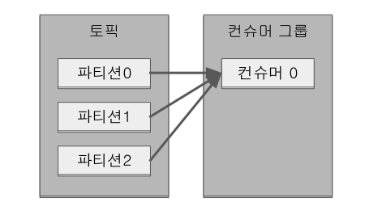
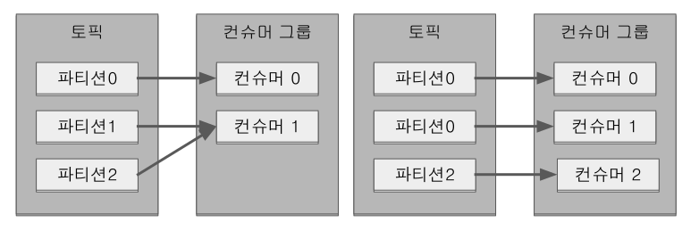
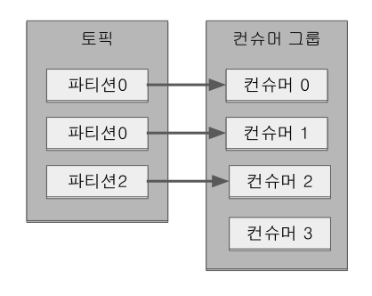
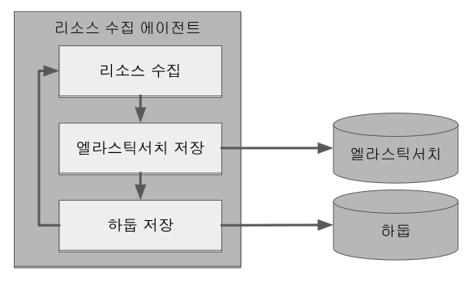
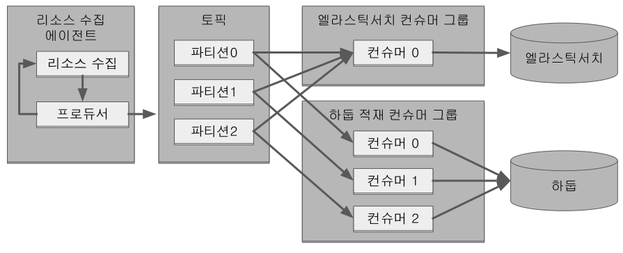
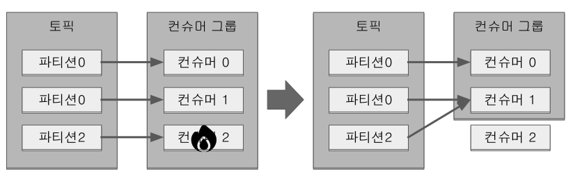
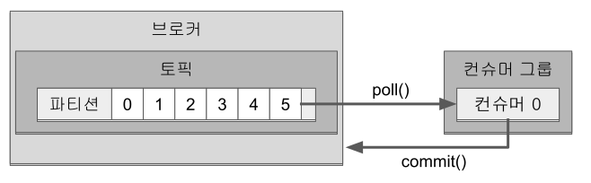
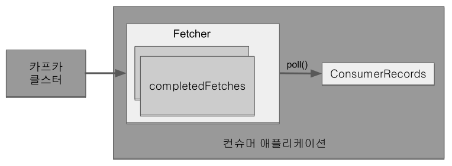

#### 3.4.2 컨슈머 API

프로듀서가 전송한 데이터는 카프카 브로커에 적재 +
컨슈머는 브로커로부터 데이터를 가져와서 처리

**카프카 컨슈머 프로젝트 생성**

gradle를 이용하여 프로젝트 초기화

```
gradle init --type java-application --dsl groovy --test-framework junit-jupiter
mv app/* .
rmdir app
```

```
$ gradle init --type java-application --dsl groovy --test-framework junit-jupiter
Starting a Gradle Daemon, 1 incompatible and 1 stopped Daemons could not be reused, use --status for details

Generate build using new APIs and behavior (some features may change in the next minor release)? (default: no) [yes, no]
 no

Project name (default: kafka-consumer): kafka-consumer

Source package (default: kafka.consumer): com.moss.kafka.consumer


> Task :init
Get more help with your project: https://docs.gradle.org/7.4.1/samples/sample_building_java_applications.html

BUILD SUCCESSFUL in 41s
2 actionable tasks: 2 executed
```

초기화 후 폴더 구조
```
.
├── build.gradle       # 1
├── gradle             # 2
│   └── wrapper
│       ├── gradle-wrapper.jar
│       └── gradle-wrapper.properties
├── gradlew
├── gradlew.bat
├── settings.gradle
└── src
    ├── main
    │   ├── java       # 3
    │   │   └── com
    │   │       └── moss
    │   │           └── kafka
    │   │               └── producer
    │   │                   └── App.java
    │   └── resources
    └── test
        ├── java
        │   └── com
        │       └── moss
        │           └── kafka
        │               └── producer
        │                   └── AppTest.java
        └── resources
```

. 프로젝트를 빌드하기 위한 작업이나 디펜더시를 정의 가능
. 그래들(gradle)로 생성한 프로젝트의 구조를 선언. 주로 멀티 프로젝트 구조 정의
. 코드가 위치할 디렉토리

**settings.gradle, build.gradle 수정**

link:https://docs.confluent.io/platform/current/clients/index.html[Kafka Clients]

.settings.gradle
```
rootProject.name = 'kafka-consumer'
```

.build.gradle
```
plugins {
    id 'java'
    id 'application'
}

group 'com.moss.kafka'
version '1.0'

repositories {
    mavenCentral()
}

dependencies {
    implementation 'org.apache.kafka:kafka-clients:3.1.0'
    implementation 'org.slf4j:slf4j-simple:1.7.36'

    testImplementation 'org.junit.jupiter:junit-jupiter:5.8.1'
}

application {
    mainClass = 'com.moss.kafka.consumer.App'
}

tasks.named('test') {
    useJUnitPlatform()
}
```

**src/main/java/com/moss/kafka/consumer/App.java 수정**

기본 설정으로 생성할 수 있는 오토 커밋(auto commit) 카프카 컨슈머 애플리케이션 작성

.App.java
```
package com.moss.kafka.consumer;

import org.apache.kafka.clients.consumer.*;
import org.apache.kafka.common.serialization.StringDeserializer;
import org.slf4j.Logger;
import org.slf4j.LoggerFactory;

import java.time.Duration;
import java.util.Arrays;
import java.util.Properties;

public class App {
    private final static Logger logger = LoggerFactory.getLogger(App.class);
    private final static String TOPIC_NAME = "test";  // 1
    private final static String BOOTSTRAP_SERVERS = "localhost:9092,localhost:9093,localhost:9094";  // 2
    private final static String GROUP_ID = "test-group";  // 3

    public static void main(String[] args) {
        Properties configs = new Properties();
        configs.put(ConsumerConfig.BOOTSTRAP_SERVERS_CONFIG, BOOTSTRAP_SERVERS);  // 2
        configs.put(ConsumerConfig.GROUP_ID_CONFIG, GROUP_ID);  // 3
        configs.put(ConsumerConfig.KEY_DESERIALIZER_CLASS_CONFIG, StringDeserializer.class.getName());  // 4
        configs.put(ConsumerConfig.VALUE_DESERIALIZER_CLASS_CONFIG, StringDeserializer.class.getName());  // 4

        KafkaConsumer<String, String> consumer = new KafkaConsumer<>(configs);  // 5
        consumer.subscribe(Arrays.asList(TOPIC_NAME));  // 6

        while (true) {  // 7
            ConsumerRecords<String, String> records = consumer.poll(Duration.ofSeconds(1));  // 8
            for (ConsumerRecord<String, String> record: records) {  // 9
                logger.info("{}", record);
            }
        }
    }
}
```

설명 추가
```
package com.moss.kafka.consumer;

import org.apache.kafka.clients.consumer.ConsumerConfig;
import org.apache.kafka.clients.consumer.ConsumerRecord;
import org.apache.kafka.clients.consumer.ConsumerRecords;
import org.apache.kafka.clients.consumer.KafkaConsumer;
import org.apache.kafka.common.serialization.StringDeserializer;
import org.slf4j.Logger;
import org.slf4j.LoggerFactory;

import java.time.Duration;
import java.util.Arrays;
import java.util.Properties;

public class App {
    private final static Logger logger = LoggerFactory.getLogger(App.class);
    // 1. 토픽 이름
    private final static String TOPIC_NAME = "test";
    // 2. 카프카 클러스터 서버 IP:port 목록
    private final static String BOOTSTRAP_SERVERS = "localhost:9092,localhost:9093,localhost:9094";
    // 3. 커슈머 그룹 이름
    // 컨슈머 그룹을 통해 컨슈머의 목적을 구분 가능
    // 컨슈머 그룹을 기준으로 컨슈머 오프셋을 관리하기 때문에 subscribe() 메서드를 사용하여 토픽을 구독하는 경우에는 컨슈머 그룹을 선언
    // 컨슈머가 중단되거나 재시작 되더라도 컨슈머 그룹의 ㅋ컨슈머 오프셋을 기준으로 이후 데이터 처리를 하기 때문
    // 커슈머 그룹을 선언하지 않으면 어떤 그룹에도 속하지 않은 컨슈머로 동작
    private final static String GROUP_ID = "test-group";

    public static void main(String[] args) {
        Properties configs = new Properties();
        configs.put(ConsumerConfig.BOOTSTRAP_SERVERS_CONFIG, BOOTSTRAP_SERVERS);  // 2
        configs.put(ConsumerConfig.GROUP_ID_CONFIG, GROUP_ID);  // 3
        // 4. 메시지 키, 메시지 값 역직렬화 클래스 선언
        // 메시지 키, 메시지 값에 대해 둘 다 역직렬화 클래스를 지정해야 하며 반드시 프로듀서에서 직렬화한 타입으로 역직렬화
        // 일치하지 않은 타입으로 역직렬화할 경우 정상적으로 타입 변환이 되지 않을 수 있음
        configs.put(ConsumerConfig.KEY_DESERIALIZER_CLASS_CONFIG, StringDeserializer.class.getName());
        configs.put(ConsumerConfig.VALUE_DESERIALIZER_CLASS_CONFIG, StringDeserializer.class.getName());

        // 5. 컨슈머 옵션을 파라미터로 받아 KafkaConsumer 인스턴스 생성
        KafkaConsumer<String, String> consumer = new KafkaConsumer<>(configs);
        // 6. 컨슈머에게 토픽을 할당하기 위해 subscribe() 메서드 사용
        // Collection 타입의 String 값들을 받는데, 1개 이상의 토픽 이름을 받을 수 있다.
        consumer.subscribe(Arrays.asList(TOPIC_NAME));

        // 7. 컨슈머는 poll() 메서드를 호출하여 데이터를 가져와서 처리
        // 지속적으로 데이터를 처리하기 위해서 반복 호출 필요
        // 무한루프 내부에서 poll() 메서드를 통해 데이터를 가져오고 사용자가 원하는 테이터 처리를 수행
        while (true) {
            // 8. 컨슈머는 poll() 메서드를 통해 ConsumerRecord 리스트를 반환
            // poll() 메서드는 브로커로부터 데이터를 가져올 때 컨슈머 버퍼에 데이터를 기다리기 위한 타임아웃 간격을 Duration 타입의 인자로 받음
            ConsumerRecords<String, String> records = consumer.poll(Duration.ofSeconds(1));
            // 9. for loop를 통해 poll 메서드가 반환한 ConsumerRecord 데이터를 순차적으로 처리
            for (ConsumerRecord<String, String> record: records) {
                logger.info("{}", record);
            }
        }
    }
}
```

**프로그램 실행**

.kafka-console-producer 로 데이터 추가
```
$ bin/kafka-console-producer.sh --bootstrap-server localhost:9092,localhost:9093,localhost:9094 --topic test
> testMessage
```

'./gradlew run' 명령어로 실행

```
$ ./gradlew run

> Task :run
#### 1 ####
[main] INFO org.apache.kafka.clients.consumer.ConsumerConfig - ConsumerConfig values:
        allow.auto.create.topics = true
        auto.commit.interval.ms = 5000
        auto.offset.reset = latest
        bootstrap.servers = [localhost:9092, localhost:9093, localhost:9094]
        check.crcs = true
        client.dns.lookup = use_all_dns_ips
        client.id = consumer-test-group-1
        client.rack =
        connections.max.idle.ms = 540000
        default.api.timeout.ms = 60000
        enable.auto.commit = true
        exclude.internal.topics = true
        fetch.max.bytes = 52428800
        fetch.max.wait.ms = 500
        fetch.min.bytes = 1
        group.id = test-group
        group.instance.id = null
        heartbeat.interval.ms = 3000
        interceptor.classes = []
        internal.leave.group.on.close = true
        internal.throw.on.fetch.stable.offset.unsupported = false
        isolation.level = read_uncommitted
        key.deserializer = class org.apache.kafka.common.serialization.StringDeserializer
        max.partition.fetch.bytes = 1048576
        max.poll.interval.ms = 300000
        max.poll.records = 500
        metadata.max.age.ms = 300000
        metric.reporters = []
        metrics.num.samples = 2
        metrics.recording.level = INFO
        metrics.sample.window.ms = 30000
        partition.assignment.strategy = [class org.apache.kafka.clients.consumer.RangeAssignor, class org.apache.kafka.clients.consumer.CooperativeStickyAssignor]
        receive.buffer.bytes = 65536
        reconnect.backoff.max.ms = 1000
        reconnect.backoff.ms = 50
        request.timeout.ms = 30000
        retry.backoff.ms = 100
        ... sasl.*
        security.protocol = PLAINTEXT
        security.providers = null
        send.buffer.bytes = 131072
        session.timeout.ms = 45000
        socket.connection.setup.timeout.max.ms = 30000
        socket.connection.setup.timeout.ms = 10000
        ... ssl.*
        value.deserializer = class org.apache.kafka.common.serialization.StringDeserializer

#### 2 ####
[main] INFO org.apache.kafka.common.utils.AppInfoParser - Kafka version: 3.1.0
[main] INFO org.apache.kafka.common.utils.AppInfoParser - Kafka commitId: 37edeed0777bacb3
[main] INFO org.apache.kafka.common.utils.AppInfoParser - Kafka startTimeMs: 1648578313783
#### 3 ####
[main] INFO org.apache.kafka.clients.consumer.KafkaConsumer - [Consumer clientId=consumer-test-group-1, groupId=test-group] Subscribed to topic(s): test
...
#### 4 ####
[main] INFO com.moss.kafka.consumer.App - ConsumerRecord(topic = test, partition = 3, leaderEpoch = 47, offset = 7, CreateTime = 1648578477499, serialized key size = -1, serialized value size = 11, headers = RecordHeaders(headers = [], isReadOnly = false), key = null, value = testMessage)
```

. 컨슈머에 할당된 옵션들. 직접 설정한 옵션들은 설정되고 설저하지 않은 다른 옵션들은 기본값으로 설정
. 카프카 컨슈머 라이브러리 버전
. 컨슈머가 구독하고 있는 토픽 이름
. test 토픽으로부터 데이터를 polling하여 로그로 출력 +
레코드의 파티션 번호, 오프셋, 레코드가 브로커에 들어간 날짜, 메시지 키, 메시지 값 확인 가능

**컨슈머 중요 개념**

컨슈머를 운영하는 2가지 방법

. 1개 이상의 컨슈머로 이루어진 컨슈머 그룹 운영
. 토픽의 특정 파티션만 구독하는 컨슈머를 운영

컨슈머 그룹으로 운영하는 방법 +
컨슈머를 각 컨슈머 그룹으로부터 격리된 환경에서 안전하게 운영할 수 있도록 도와주는 카프카의 독특한 방식 +
컨슈머 그룹으로 묶인 컨슈머들은 토픽의 1개 이상 파티션들에 할당되어 데이터를 가져갈 수 있음

[.text-center]
.컨슈머 1개로 이루어진 컨슈머 그룹이 3개의 파티션에 할당


1개의 파티션은 최대 1개의 컨슈머에 할당 가능 +
1개의 컨슈머는 여러 개의 파티션에 할당 가능 +
컨슈머 그룹의 컨슈머 개수는 토픽의 파티션 개수와 같거나 작아야 함. (컨슈머 그룹의 컨슈머 수 \<= 파티션 수)

[.text-center]
.컨슈머 2개, 컨슈머 3개인 경우


만약 4개의 컨슈머로 이루어진 컨슈머 그룹으로 3개의 파티션을 가진 토픽에서 데이터를 가져가기 위해 할당하면 1개의 컨슈머는 파티션을 할당받지 못하고 유휴 상태로 남음.
파티션을 할당받지 못한 컨슈머는 스레드만 차지하고 실질적인 데이터 처리를 하지 못하므로 애플리케이션 실행에 있어 불필요한 스레드로 남음.

[.text-center]
.컨슈머 1개가 놀고 있는 모습


컨슈머 그룹은 다른 컨슈머 그룹과 격리 +
카프카 프로듀서가 보낸 데이터를 각기 다른 역할을 하는 컨슈머 그룹간 영향을 받지 않게 처리 가능

예를 들어, 운영 서버의 주요 리소스인 CPU, 메모리 정보를 수집하는 데이터 파이프라인을 구축한다고 가정해 보자.
실시간 리소스를 시간순으로 확인하기 우해서 데이터를 엘라스틱서치에 저장하고 이와 동시에 대용량 적재를 위해 하둡에 적재할 것이다.
만약 카프카를 활용한 파이프라인이 아니라면 서버에서 실행되는 리소스 수집 및 전송 에이전트는 수집한 리소스를 엘라스틱서치와 하둡에 적재하기 위해 동기적으로 적재를 요청할 것이다.
이렇게 동기로 실행되는 에이전트는 엘라스틱서치 또는 하둡 둘 중 하나에 장애가 발생한다면 더는 적재가 불가능할 수 있다.

[.text-center]
.동기 로직으로 돌아가는 에이전트 애플리케이션


반면, 카프카는 이러한 파이프라인을 운영함에 있어 최종 적재되는 저장소의 장애에 유연하게 대응할 수 있도록
각기 다른 저장소에 저장하는 컨슈머를 다른 컨슈머 그룹으로 묶음으로써 각 저장소의 장애에 격리되어 운영할 수 있다.
따라서 엘라스틱서치의 장애로 인해 더는 적재가 되지 못하더라도 하둡으로 데이터를 적재하는 데에는 문제가 없다.
엘라스틱서치의 장애가 해소되면 엘라스틱서치로 적재하는 컨슈머의 컨슈머 그룹은
마지막으로 적재 완료한 데이터 이후부터 다시 적재를 수행하여 최종적으로 모두 정상화될 것이다.
이렇게 데이터 파이프라인을 운영함에 있어 적절히 컨슈머 그룹을 분리하여 운영하는 것은 매우 중요하다.
분리하여 운영할 수 있음에도 불구하고 동일 컨슈머 그룹으로 이루어진 컨슈머가 엘라스틱서치와 하둡에 동시 적재한다면
이전에 동기로 적재하는 에이전트와 동일한 이슈로 적재에 지연이 발생할 수 있기 때문이다.
현재 운영하고 있는 토픽의 데이터가 어디에 적재되는지, 어떻게 처리되는지 파악하고 컨슈머 그룹으로 따로 나눌 수 있는 것은 최대한 나누는 것이 좋다.

[.text-center]
.컨슈머 그룹으로 적재 로직을 분리하여 운영


컨슈머 그룹으로 이루어진 컨슈머들 중 일부 컨슈머에 장애 발생 시, 장애가 발생한 컨슈머에 할당된 파티션은 장애가 발생하지 않은 컨슈머로 소유권이 넘어감. +
이 과정을 '리밸런싱(rebalancing)'이라 부름. +
리밸런싱은 크게 두 가지 상황에서 발생 +
첫 번째는 컨슈머가 추가되는 상황 +
두 번째는 컨슈머가 제외되는 상황

리밸런싱은 컨슈머가 데이터를 처리하는 도중에 언제든지 발생할 수 있으므로 데이터 처리 중 발생한 리밸런싱에 대응하는 코드 작성 필요

[.text-center]
.컨슈머 장애 발생시 리밸런싱 발생


가용성을 높이면서도 안정적인 운영을 도와주는 리밸런싱은 유용하지만 자주 일어나서는 안됨 +
리밸런싱이 발생할 때 파티션 소유권을 컨슈머로 재할당하는 과정에서 해당 컨슈머 그룹의 컨슈머들이 토픽의 데이터를 읽을 수 없기 때문

그룹 조정자(group coordinator)는 리밸런싱을 발동시키는 역할을 하는데 컨슈머 그룹의 컨슈머가 추가되고 삭제될 떄는 감지 +
카프카 브로커 중 한 대가 그룹 조정자의 역할을 수행

컨슈머는 브로커로부터 데이터를 어디까지 가져갔는지 커밋(commit)을 통해 기록 +
특정 토픽의 파티션을 어떤 컨슈머 그룹이 몇 번째까지 가져갔는지 브로커 내부에서 사용되는 내부 토픽(__consumer_offset)에 기록 +
컨슈머 동작 이슈가 발생하여 __consumer_offsets 토픽에 어느 레코드까지 읽어갔는지 오프셋 커밋이 기록되지 못했다면 데이터 처리의 중복이 발생 가능 +
그러므로 데이터 처리의 중복이 발생하지 않게 하기 위해서는 컨슈머 애플리케이션이 오프셋 커밋을 정상적으로 처리했는지 검증 해야함

[.text-center]
.컨슈머는 처리 완료한 레코드의 오프셋을 커밋한다


오프셋 커밋은 컨슈머 애플리케이션에서 명시적, 비명시적으로 수행 가능

기본 옵션은 poll() 메서드가 수행될 때 일정 간격마다 오프셋을 커밋하도록 enable.auto.commit=true 로 설정 +
이렇게 일정 간격마다 자동으로 커밋되는 것을 비명시 '오프셋 커밋'이라고 함 +
이 옵션은 auto.commit.interval.ms 에 설정된 값과 함께 사용 +
poll() 메서드가 auto.commit.interval.ms 에 설정된 값 이상이 지났을 때 그 시점까지 읽은 레코드의 오프셋을 커밋 +
poll() 메서드를 호출할 때 커밋을 수행하므로 코드상에서 따로 커밋 관련 코드 작성 불필요 +
비명시 오프셋 커밋은 편리하지만 poll() 메서드 호출 이후에 리밸런싱 또는 컨슈머 강제종료 발생 시 컨슈머가 처리하는 데이터가 중복 또는 유식될 수 있는 가능성이 있는 취약한 구조 +
그러므로 데이터 중복이나 유실을 허용하지 않는 서비스라면 자동 커밋을 사용해서는 안 된다.

명시적으로 오프셋을 커밋하려면 poll() 메서드 호출 이후에 반환받은 데이터의 처리가 완료되고 commitSync() 메서드를 호출 +
commitSync() 메서드는 poll() 메서드를 통해 반환된 레코드의 가장 마지막 오프셋을 기준으로 커밋을 수행 +
commitSync() 메서드는 브로커에 커밋 요청을 하고 커밋이 정상적으로 처리되었는지 응답하기까지 기다리는데 이는 컨슈머의 처리량에 영향을 끼침 +
데이터 처리 시간에 비해 커밋 요청 및 응답에 시간이 오래 걸린다면 동일 시간당 데이터 처리량이 감소하기 때문 +
이를 해결하기 위해 commitAsync() 메서드를 사용하여 커밋 요청을 전송하고 응답이 오기 전까지 데이터 처리를 수행 가능 +
하지만 비동기 커밋은 커밋 요청이 실패했을 경우 현재 처리 중인 데이터의 순서를 보장하지 않으며 데이터의 중복 처리가 발생할 수 있다.

[.text-center]
.컨슈머 내부 구조


컨슈머의 내부 구조 +
컨슈머는 poll() 메서드를 통해 레코드들을 반환받지만 poll() 메서드를 호출하는 시점에 클러스터에서 데이터를 가져오는 것이 아님 +
컨슈머 애플리케이션을 실행하게 되면 내부에서 Fetcher 인스턴스가 생성되어 poll() 메서드를 호출하기 전에 미리 레코드들을 내부 큐로 가져옴 +
이후 명시적으로 poll() 메서드를 호출하면 컨슈머는 내부 큐에 있는 레코드들을 반환받아 처리를 수행

**컨슈머 주요 옵션**

link:https://kafka.apache.org/documentation.html#consumerconfigs[Consumer Configs] +
link:https://github.com/apache/kafka/blob/trunk/clients/src/main/java/org/apache/kafka/clients/consumer/ConsumerConfig.java#L336[Default Cofig]

[cols="1,9"]
.필수옵션
|===
|옵션|설명

|bootstrap.servers|브로커 호스트 이름:포트 1개 이상. 2개 이상 입력하면 일부 브로커에 이슈가 발생하더라도 접속하는데 이슈 없도록 설정 가능.
|key.deserializer|레코드의 메시지 키를 역직렬화하는 클래스
|value.deserializer|레코드의 메시지 값을 역직렬화하는 클래스
|===

[cols="1,9"]
.선택옵션
|===
|옵션|설명

|group.id|기본값: null +
컨슈머 그룹 아이디 지정. subscribe() 메서드로 토픽을 구독하여 사용할 때는 이 옵션은 필수.

|auto.offset.reset
a|기본값: latest +
컨슈머 그룹이 특정 파티션을 읽을 때 저장된 컨슈머 오프셋이 없는 경우 어느 오프셋부터 읽을지 선택하는 옵션 +
이미 컨슈머 오프셋이 있다면 이 옵션값은 무시 +
사용 가능 옵션: [latest, earliest, none] 중 1개 +
ㆍ latest: 가장 높은(가장 최근에 넣은) 오프셋부터 읽기 시작 +
ㆍ earliest: 가장 낮은(가장 오래전에 넣은) 오프셋부터 읽기 시작 +
ㆍ none: 컨슈머 그룹이 커밋한 기록이 있는지 찾아보고, 커밋 기록이 없으면 오류를 반환, 커밋 기록이 있다면 기존 커밋 기록 이후 오프셋부터 읽기 시작

|enable.auto.commit|기본값: true +
자동 커밋 여부

|auto.commit.interval.ms|기본값: 5000 (5초) +
자동 커밋(enabled.auto.commit=true)일 경우 오프셋 커밋 간격 지정

|max.poll.records|기본값: 500 +
poll() 메서드를 통해 반환되는 최대 레코드 개수 지정

|session.timeout.ms|기본값: 45000 (45초) +
컨슈머가 브로커와 연결이 끊기는 최대 시간 +
이 시간 내에 하트비트(heartbeat)를 전송하지 않으면 브로커는 컨슈머에 이슈가 발생했다고 가정하고 리밸런싱을 시작 +
보통 하트비트 시간 간격의 3배로 설정 +
이 값은 브로커 설정의 허용 범위내로 설정 되어야 함. +
group.min.session.timeout.ms (default: 6s) ~ group.max.session.timeout.ms (default: 30m)

|heartbeat.interval.ms|기본값: 3000 (3초) +
하트비트를 전송하는 시간 간격 +
session.timeout.ms 보다 작아야 함. 보통 1/3보다 크지 않게 설정.

|max.poll.interval.ms|기본값: 300000 (5분) +
poll() 메서드를 호출하는 간격의 최대 시간을 지정 +
poll() 메서드를 호출한 이후에 데이터를 처리하는 데에 시간이 너무 많이 걸리는 경우 비정상으로 판단하고 리밸런싱을 시작

|isolation.level|기본값: read_uncommitted +
트랜잭션 프로듀서가 레코드를 트랜잭션 단위로 보낼 경우 사용 +
사용 가능 옵션: [read_committed, read_uncommitted] 중 1개 +
ㆍ read_committed: 커밋이 완료된 레코드만 읽음
ㆍ read_uncommitted: 커밋 여부와 관계없이 파티션에 있는 모든 레코드를 읽음
|max.partition.fetch.bytes|기본값: 1048576 (1mebibyte) +
fetch 시 반환받을 파티션당 데이터의 최대 크기
|fetch.max.bytes|기본값: 52428800 (50mebibyte) +
fetch 시  반환받을 데이터의 최대 크기
|===

**동기 오프셋 커밋**

poll() 메서드가 호출된 이후에 commitSync() 메서드를 호출하여 오프셋 커밋을 명시적으로 수행

.AppCommitSync.java
```
configs.put(ConsumerConfig.ENABLE_AUTO_COMMIT_CONFIG, false);

KafkaConsumer<String, String> consumer = new KafkaConsumer<>(configs);
consumer.subscribe(Arrays.asList(TOPIC_NAME));

while (true) {
    ConsumerRecords<String, String> records = consumer.poll(Duration.ofSeconds(1));
    for (ConsumerRecord<String, String> record: records) {
        logger.info("{}", record);
    }
    consumer.commitSync();
}
```

commitSync()는 poll() 메서드로 받은 가장 마지막 레코드의 오프셋을 기준으로 커밋 +
동기 오프셋 커밋을 사용할 경우에는 poll() 메서드로 받은 모든 레코드의 처리가 끝난 이후 commitSync() 메서드를 호출 +
동기 커밋의 경우 브로커로 커밋을 요청한 이후에 커밋이 완료되기까지 대기 +
브로커로부터 컨슈머 오프셋 커밋이 완료되었음을 받기까지 컨슈머는 데이터를 더 처리하지 않고 기다리기 때문에
자동 커밋이나 비동기 오프셋 커밋보다 동일 시간당 데이터 처리량이 적음

commitSync()에 파라미터가 들어가지 않으면 poll()로 반환된 가장 마지막 레코드의 오프셋을 기준으로 커밋 +
개별 레코드 단위로 매번 오프셋을 커밋하고 싶다면, commitSync() 메서드에 Map<TopicPartition, OffsetAndMetadata> 인스터스를 파라미터로 넣음

.AppCommitSyncOffset.java
```
// 1. 명시적 오프셋 커밋 수행
configs.put(ConsumerConfig.ENABLE_AUTO_COMMIT_CONFIG, false);

KafkaConsumer<String, String> consumer = new KafkaConsumer<>(configs);
consumer.subscribe(Arrays.asList(TOPIC_NAME));

while (true) {
    ConsumerRecords<String, String> records = consumer.poll(Duration.ofSeconds(1));
    // 2. 현재 처리한 오프셋을 매번 커밋하기 위해 commitSync() 메서드가 파라미터로 받을 HashMap 타입 선언
    // HashMap 키는 토픽과 파티션 정보가 담긴 TopicPartition, 값은 오프셋 정보가 담긴 OffsetAndMetadata
    Map<TopicPartition, OffsetAndMetadata> currentOffset = new HashMap<>();

    for (ConsumerRecord<String, String> record: records) {
        logger.info("{}", record);
        // 3. 처리 완료 레코드 정보로 Map<TopicPartition, OffsetAndMetadata> 인스턴스에 키/값 설정
        // 주의할 점은 현재 처리한 오프셋에 1을 더한 값을 커밋해야 하는 점
        // 컨슈머가 poll()을 수행할 때 마지막으로 커밋한 오프셋부터 레코드를 리턴하기 때문
        currentOffset.put(
                new TopicPartition(record.topic(), record.partition()),
                new OffsetAndMetadata(record.offset() + 1, null));
        // 4. commitSync() 메서드를 Map<TopicPartition, OffsetAndMetadata> 파라미터와 함께 호출
        // 해당 특정 토픽, 파티션의 오프셋이 매번 커밋
        consumer.commitSync(currentOffset);
    }
}
```

**비동기 오프셋 커밋**

동기 오프셋 커밋을 사용할 경우 커밋 응답을 기다리는 동안 데이터 처리가 일시적으로 중단 +
더 많은 데이터를 처리하기 위해서 비동기 오프셋 커밋 사용 가능 +
비동기 오프셋 커밋은 commitAsync() 메서드를 호출하여 사용

.AppCommitAsync.java
```
while (true) {
    ConsumerRecords<String, String> records = consumer.poll(Duration.ofSeconds(1));
    for (ConsumerRecord<String, String> record: records) {
        logger.info("{}", record);
    }
    consumer.commitAsync();
}
```

비동기 오프셋 커밋도 동기 커밋과 마찬가지로 poll() 메서드로 반환된 가장 마지막 레코드를 기준으로 오프셋을 커밋 +
다만, 동기 오프셋 커밋과 다른 점은 커밋이 완료될 때까지 응답을 기다리지 않는다는 것 +
이 때문에 동기 오프셋 커밋을 사용할 때보다 동일 시간당 데이터 처리량이 더 많음 +
비동기 오프셋 커밋을 사용할 경우 비동기로 커밋 응답을 받기 때문에 callback 함수를 파라미터로 받아서 결과 확인 가능

.AppCommitAsyncCallback.java
```
consumer.commitAsync(new OffsetCommitCallback() {
    @Override
    public void onComplete(Map<TopicPartition, OffsetAndMetadata> offsets, Exception exception) {
        if (exception != null) {
            System.err.println("Commit Failed");
        } else {
            System.out.println("Commit succeeded");
        }

        if (exception != null) {
            logger.error("Commit failed for offset {}", offsets, exception);
        }
    }
});
```

lambda 사용
```
consumer.commitAsync((offsets, exception) -> {
    if (exception != null) {
        System.err.println("Commit Failed");
    } else {
        System.out.println("Commit succeeded");
    }

    if (exception != null) {
        logger.error("Commit failed for offset {}", offsets, exception);
    }
});
```

OffsetCommitCallback 는 commitAsync()의 응답을 받을 수 있도록 도와주는 콜백 인터페이스 +
비동기로 받은 커밋 응답은 onComplete() 메서드를 통해 확인 가능 +
정상적으로 커밋되었다면 Exception 변수는 null 이고, 커밋 완료된 오프셋 정보가 Map<TopicPartition, OffsetAndMetadata>에 포함 +
커밋이 실패했다면 Exception 변수에 에러값이 포함하여 실패 사유 확인 가능

**리밸런스 리스너를 가진 컨슈머**

컨슈머 그룹에서 컨슈머가 추가 또는 제거되면 파티션을 컨슈머에 재할당하는 과정인 리밸런스가 발생 +
poll() 메서드를 통해 반환받은 데이터를 모두 처리하기 전에 리밸런스가 발생하면 데이터가 중복 처리될 수 있음 +
poll() 메서드를 통해 받은 데이터 중 일부를 처리했으나 커밋하지 않았기 때문

리밸런스 발생 시 데이터를 중복 처리하지 않게 하기 위해서는 리밸런스 발생 시 처리한 데이터를 기준으로 커밋을 시도해야 함 +
리밸런스 발생을 감지하기 위해 카프카 라이브러리는 ConsumerRebalanceListener 인터페이스를 지원 +
ConsumerRebalanceListener는 onPartitionAssigned(), onPartitionRevoked() 메서드로 이루어 짐 +
onPartitionAssigned()는 리밸런스가 끝난 뒤에 파티션이 할당 완료되면 호출되는 메서드 +
onPartitionRevoked()는 리밸런스가 시작되기 직전에 호출되는 메서드

마지막으로 처리한 레코드를 기준으로 커밋을 하기 위해서는 리밸런스가 시작하기 직전에 커밋을 해야 함 +
onPartitionRevoked() 에 커밋을 구현하여 처리 가능

.AppRebalanceListener.java
```
private static KafkaConsumer<String, String> consumer;
private final static Map<TopicPartition, OffsetAndMetadata> currentOffset = new HashMap<>();

public static void main(String[] args) {
    Properties configs = new Properties();
    configs.put(ConsumerConfig.BOOTSTRAP_SERVERS_CONFIG, BOOTSTRAP_SERVERS);
    configs.put(ConsumerConfig.GROUP_ID_CONFIG, GROUP_ID);
    configs.put(ConsumerConfig.KEY_DESERIALIZER_CLASS_CONFIG, StringDeserializer.class.getName());
    configs.put(ConsumerConfig.VALUE_DESERIALIZER_CLASS_CONFIG, StringDeserializer.class.getName());
    // 1. 리밸런스 발생 시 수동 커밋을 하기 위해 명시적 오프셋 커밋 설정
    configs.put(ConsumerConfig.ENABLE_AUTO_COMMIT_CONFIG, false);

    consumer = new KafkaConsumer<>(configs);
    // 2. ConsumerRebalanceListener 인터페이스를 구현한 RebalanceListener를
    // subscribe() 메서드의 오버라이드 변수로 포함
    consumer.subscribe(Arrays.asList(TOPIC_NAME), new RebalanceListener());

    while (true) {
        ConsumerRecords<String, String> records = consumer.poll(Duration.ofSeconds(1));

        for (ConsumerRecord<String, String> record: records) {
            logger.info("{}", record);
            // 3. 레코드의 데이터 처리가 끝나면 레코드가 속한 토픽, 파티션, 오프셋 정보를 HashMap에 담음
            // 이 HashMap 값은 오프셋 지정 커밋 시에 사용
            // 주의할 점은 offset + 1 값을 넣어야 한다는 점
            // 컨슈머 재시작 시에 파티션에서 가장 마지막으로 커밋된 오프셋부터 레코드를 읽기 시작하기 때문
            currentOffset.put(
                    new TopicPartition(record.topic(), record.partition()),
                    new OffsetAndMetadata(record.offset() + 1, null));
            consumer.commitSync(currentOffset);
        }
    }
}

// 2
private static class RebalanceListener implements ConsumerRebalanceListener {

    @Override
    public void onPartitionsRevoked(Collection<TopicPartition> partitions) {
        logger.warn("Partitions are revoked");
        // 4. 리밸런스가 발생하면 가장 마지막으로 처리 완료한 레코드를 기준으로 커밋을 실시
        // 이를 통해 데이터 처리의 중복을 방지
        consumer.commitSync(currentOffset);
    }

    @Override
    public void onPartitionsAssigned(Collection<TopicPartition> partitions) {
        logger.warn("Partitions are assigned");
    }
}
```

**파티션 할당 컨슈머**

직접 파티션을 컨슈머에 명시적으로 할당하여 운영 가능 +
assign() 을 사용하여 컨슈머에 어떤 토픽, 파티션을 할당할지 명시적으로 선언 +
assign() 은 다수의 TopicPartition 인스턴스를 지닌 자바 컬렉션(collection) 타입을 파라미터로 받음 +
TopicPartition 클래스는 카프카 라이브러리 내/외부에서 사용되는 토픽, 파티션의 정보를 담는 객체로 사용

.AppAssign.java
```
private final static String TOPIC_NAME = "test";
private final static int PARTITION_NUMBER = 0;

public static void main(String[] args) {
    Properties configs = new Properties();
    ...

    KafkaConsumer<String, String> consumer = new KafkaConsumer<>(configs);
    consumer.assign(Collections.singleton(new TopicPartition(TOPIC_NAME, PARTITION_NUMBER)));

    while (true) {
        ConsumerRecords<String, String> records = consumer.poll(Duration.ofSeconds(1));
        for (ConsumerRecord<String, String> record: records) {
            logger.info("{}", record);
        }
    }
}
```

subscribe() 대신 assign() 를 사용 +
test의 0번 파티션을 할당하여 레코드들을 가져옴 +
subscribe() 를 사용할 때와 다르게 직접 컨슈머가 특정 토픽, 특정 파티션에 할당되므로 리밸런싱 하는 과정이 없음

**컨슈머에 할당된 파티션 확인 방법**
컨슈머에 할당된 토픽과 파티션에 대한 정보는 assignment() 메서드로 확인 가능 +
assignment() 메서드는 Set<TopicPartition> 인스턴스를 반환 +
TopicPartition 클래스는 토픽 이름과 팥션 번호가 포함된 객체

```
Set<TopicPartition> assignedTopicPartition = consumer.assignment();
System.out.println(assignedTopicPartition);
```

실행 결과
```
[test-1, test-0, test-3, test-2]
```

**컨슈머의 안전한 종료**

컨슈머 애플리케이션은 안전하게 종료되어야 함 +
정상적으로 종료되지 않은 컨슈머는 세션 타임아웃이 발생할때까지 컨슈머 그룹에 남음 +
이로 인해 실제로는 종료되었지만 더는 동작하지 않는 컨슈머가 존재하기 때문에 파티션의 데이터는 소모되지 못하고 컨슈머 랙이 증가 +
컨슈머 렉이 증가하면 데이터 처리 지연이 발생 +
컨슈머를 안전하게 종료하기 위해 KafkaConsumer 클래스는 wakeup() 메서드를 지원 +
wakeup()가 실행된 이후 poll() 메서드가 호출되면 WakeupException 예외가 발생 +
WakeupException 예뢰를 받은 뒤에는 데이터 처리를 위해 사용한 자원들을 해제 +
마지막에는 close() 메서드를 호출하여 카프카 클러스터에 컨슈머가 안전하게 종료되었음을 명시적으로 알려주면 종료가 완료 +
close() 메서드를 호출하면 해당 컨슈머는 더는 동작하지 않는다는 것을 명시적으로 알려주므로 컨슈머 그룹에서 이탈되고 나머지 컨슈머들이 파티션을 할당 받음

.AppShutdownHook.java
```
try {
    while (true) {
        ConsumerRecords<String, String> records = consumer.poll(Duration.ofSeconds(1));
        for (ConsumerRecord<String, String> record: records) {
            logger.info("{}", record);
        }
    }
} catch (WakeupException e) {
    logger.warn("Wakeup consumer");
    // 리소스 종료 처리
} finally {
    consumer.close();
}
```

poll() 메서드를 통해 지속적으로 레코드들을 받아 처리하다가 wakeup() 메서드가 호출되면, 다음 poll() 메서드가 호출될 때 WakeupException 예외 발생 +
예외가 발생하면 catch 문이 WakeupException을 받아서 컨슈머 종료 전에 사용하던 리소스들을 해제 가능

wakeup() 메서드 호출 위치 +
자바 애플리케이션의 경우 코드 내부에 셧다운 훅(shutdown hook)을 구현하여 안전하고 종료를 명시적으로 구현 가능 +
셧다운 훅이란 사용자 또는 운영체제로부터 종료 요청을 받으면 실행하는 스레드

.AppShutdownHook.java
```
public static void main(String[] args) {
    Runtime.getRuntime().addShutdownHook(new Thread() {
        @Override
        public void run() {
            logger.info("Shutdown hook");
            consumer.wakeup();
        }
    });
    ...
}
```

사용자는 안전한 종료를 위해 위 코드로 실행된 애플리케이션에 kill -TERM {프로세스 번호} 를 호출하여 셧다운 훅을 발생 가능 +
셧다운 훅이 발생하면 사용자가 정의한 ShutdownThread 스레드가 실행되면서 wakeup() 메서드가 호출되어 컨슈머를 안전하게 종료 가능